# MCP

A curated, layered, and continuously maintained list of resources for the Model Context Protocol (MCP) ecosystem.

This repository aims to cover the MCP landscape as broadly as possible while keeping the structure clear and the inclusion standard strict. It includes official specifications, servers, clients, SDKs, frameworks, tools, registries, tutorials, examples, security references, deployment resources, and real-world use cases.

## Scope

This repository focuses on resources directly related to MCP, including:

- official MCP specifications, documentation, and standards;
- MCP servers for data access, developer workflows, productivity, research, and automation;
- MCP clients, host applications, and agent runtimes;
- SDKs, frameworks, and integration libraries;
- inspectors, testing tools, gateways, observability tools, and deployment infrastructure;
- registries, discovery directories, and curated collections;
- tutorials, technical guides, reference implementations, and examples;
- security, authentication, governance, and operational practices;
- practical applications and case studies built on MCP.

This repository does not aim to collect generic AI tooling unless its MCP relevance is clear and verifiable.

## How This List Is Organized

The list is layered by ecosystem role first, then by resource type. This avoids mixing official standards, runtime tooling, and application examples in a single flat list.

## Quick Start Paths

If you do not want to read this repository linearly, use one of these shortcuts:

- I just want to understand MCP:
  start with [MCP primer](docs/mcp-primer.md), [How MCP Works](#how-mcp-works), [Core Concepts](#core-concepts), and [Local vs Remote Servers](#local-vs-remote-servers).
- I want to build an MCP server:
  read [Protocol Method Cheat Sheet](#protocol-method-cheat-sheet), [How to Evaluate an MCP Server](#how-to-evaluate-an-mcp-server), [Build an MCP Server](https://modelcontextprotocol.io/docs/develop/build-server), and [SDK Overview](https://modelcontextprotocol.io/docs/sdk).
- I want to integrate MCP into a product:
  read [Auth and Security Boundaries](#auth-and-security-boundaries), [OAuth and Authorization Flow](#oauth-and-authorization-flow), [MCP Apps Rendering Model](#mcp-apps-rendering-model), and the client documentation for your target host.
- I want to discover production-ready projects:
  start from [Official Resources](#official-resources), [Registries and Discovery](#registries-and-discovery), [Clients](#clients), and [Deployment and Operations](#deployment-and-operations).
- I want to understand advanced MCP:
  read [Extensions and Advanced Capabilities](#extensions-and-advanced-capabilities), [Tasks for Long-Running Work](#tasks-for-long-running-work), [MCP Apps Rendering Model](#mcp-apps-rendering-model), and [Auth and Security Boundaries](#auth-and-security-boundaries).

## Read by Audience

Different readers usually need different slices of the ecosystem:

- Application users and prompt engineers:
  focus on [How MCP Works](#how-mcp-works), [Clients](#clients), [Use Cases and Case Studies](#use-cases-and-case-studies), and [Registries and Discovery](#registries-and-discovery).
- Server developers:
  focus on [Core Concepts](#core-concepts), [Protocol Method Cheat Sheet](#protocol-method-cheat-sheet), [Client Primitives](#client-primitives), [SDKs and Frameworks](#sdks-and-frameworks), and [Tools and Infrastructure](#tools-and-infrastructure).
- Client or host implementers:
  focus on [Initialization Handshake](#initialization-handshake), [Extensions and Advanced Capabilities](#extensions-and-advanced-capabilities), [MCP Apps Rendering Model](#mcp-apps-rendering-model), and [Auth and Security Boundaries](#auth-and-security-boundaries).
- Platform and enterprise teams:
  focus on [Auth and Security Boundaries](#auth-and-security-boundaries), [OAuth and Authorization Flow](#oauth-and-authorization-flow), [Deployment and Operations](#deployment-and-operations), and [What a Production-Grade MCP Server Should Have](#what-a-production-grade-mcp-server-should-have).
- Curators and maintainers of ecosystem lists:
  focus on [Reading Guide for This List](#reading-guide-for-this-list), [How to Evaluate an MCP Server](#how-to-evaluate-an-mcp-server), [Registries and Discovery](#registries-and-discovery), and [Community Resources](#community-resources).

## How MCP Works

At a high level, MCP separates the host application from the external systems it wants to use. The host speaks to MCP servers through MCP clients, while servers expose structured capabilities such as tools, resources, and prompts.

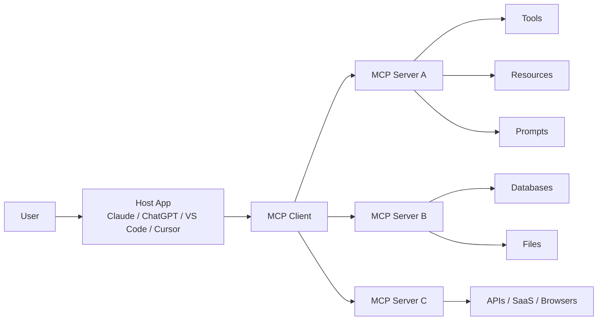

The most important protocol primitives are:

- `tools`: callable actions that the model can invoke;
- `resources`: structured or raw context that the client can read;
- `prompts`: reusable prompt templates exposed by the server.

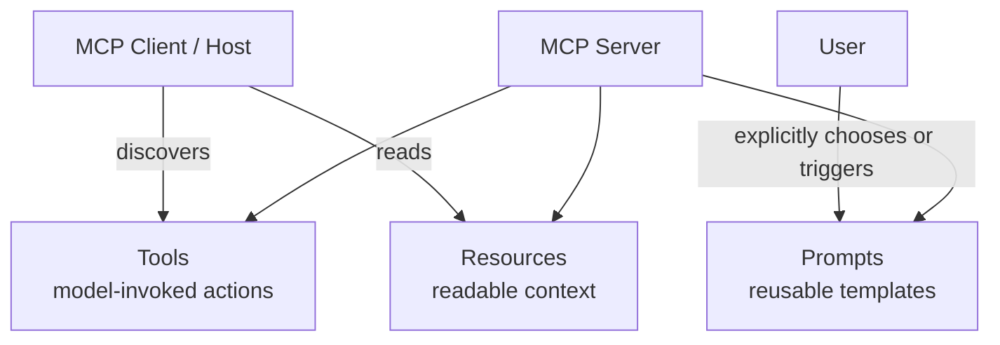

In a typical interaction, the host lists capabilities, decides what context to read, lets the model call tools when appropriate, and then returns the final answer to the user.

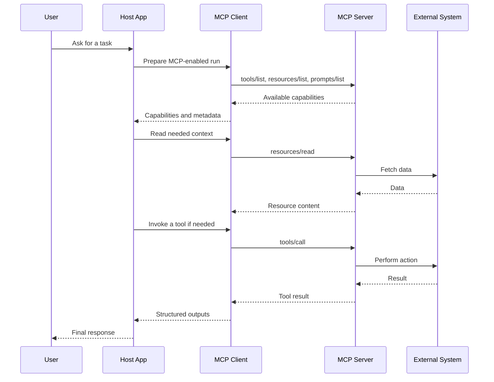

## Core Concepts

MCP is easiest to understand if you separate it into participants, layers, and primitives.

- `MCP Host`: the AI application that coordinates one or more MCP connections.
- `MCP Client`: the protocol component created by the host for a specific server connection.
- `MCP Server`: the program that exposes context and capabilities.
- `Data layer`: the JSON-RPC-based protocol for initialization, capability negotiation, tools, resources, prompts, notifications, and client-side primitives.
- `Transport layer`: the channel used to carry MCP messages, most commonly `stdio` for local servers and Streamable HTTP for remote servers.

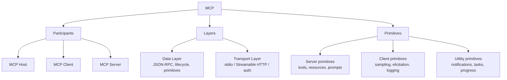

The official architecture overview is the best starting point if you want the protocol-level mental model: [Architecture Overview](https://modelcontextprotocol.io/docs/learn/architecture).

## Local vs Remote Servers

Local and remote MCP servers use the same data-layer concepts, but the operational model differs.

- Local servers usually run as child processes on the same machine and commonly use `stdio`.
- Remote servers usually run over the network and commonly use Streamable HTTP with standard web auth patterns.

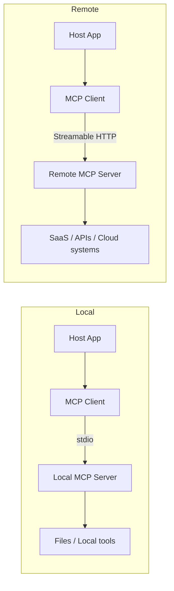

- [Connect to Local MCP Servers](https://modelcontextprotocol.io/docs/develop/connect-local-servers) - Official guide for local `stdio`-style setups.
- [Connect to Remote MCP Servers](https://modelcontextprotocol.io/docs/develop/connect-remote-servers) - Official guide for remote connectors and HTTP-based flows.

## Extensions and Advanced Capabilities

The base protocol is intentionally small. Many advanced workflows are added through official extensions or opt-in primitives.

- [MCP Apps](https://modelcontextprotocol.io/extensions/apps/overview) - Interactive HTML interfaces rendered inline inside supporting hosts.
- [Tasks](https://modelcontextprotocol.io/extensions/tasks/overview) - Durable handles for long-running operations with polling, status, and mid-flight input.
- [Extension Support Matrix](https://modelcontextprotocol.io/extensions/client-matrix) - Official matrix of which clients support which official extensions.

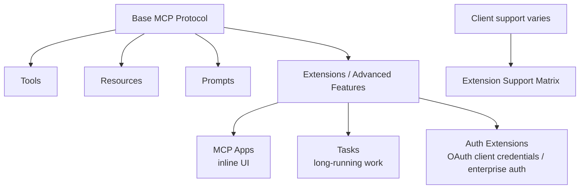

## Initialization Handshake

Before real work begins, client and server perform a lifecycle handshake. This establishes protocol compatibility and negotiates which capabilities each side supports.

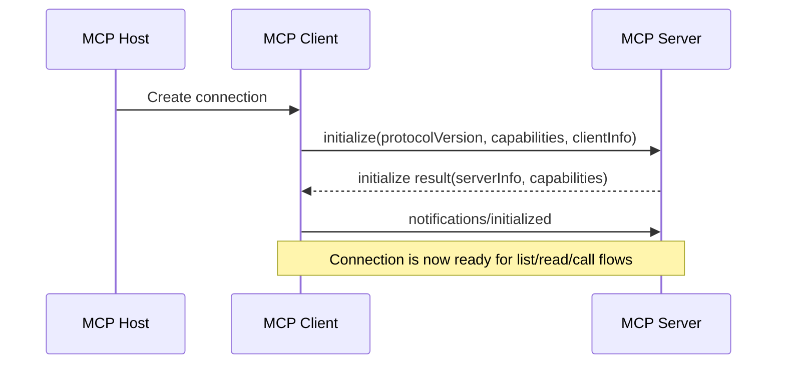

- [Architecture Overview](https://modelcontextprotocol.io/docs/learn/architecture) - Official explanation of lifecycle management, capability negotiation, and notifications.
- [Extension Support Matrix](https://modelcontextprotocol.io/extensions/client-matrix) - Shows how extension support is negotiated on top of the base handshake.

## Registry Ecosystem

The MCP Registry is not a package host. It is a metadata layer that points clients toward packages, images, or remote servers.

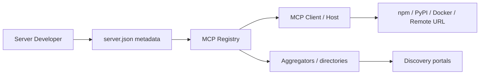

- [The MCP Registry](https://modelcontextprotocol.io/registry/about) - Official overview of the registry as a centralized metadata repository.
- [Package Types](https://modelcontextprotocol.io/registry/package-types) - Official supported installation and packaging formats.

## Protocol Method Cheat Sheet

At the protocol level, most MCP interactions reduce to a small number of discover/read/call/update methods.

- Server discovery:
  `tools/list`, `resources/list`, `resources/templates/list`, `prompts/list`
- Server execution and retrieval:
  `tools/call`, `resources/read`, `prompts/get`
- Lifecycle:
  `initialize`, `notifications/initialized`
- Client-side primitives:
  `sampling/createMessage`, `elicitation/create`
- Long-running work:
  `tasks/get`, `tasks/update`, `tasks/cancel`

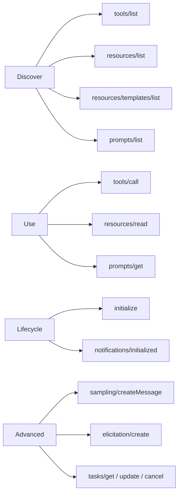

## Client Primitives

MCP is not only about what servers expose. Clients can also expose capabilities that let servers build richer workflows.

- `sampling`: lets a server ask the host application to obtain model output without embedding its own model provider.
- `elicitation`: lets a server request more information or confirmation from the user.
- `logging`: lets a server send logs to the client for debugging and operational visibility.
- `roots`: lets clients define the workspace scope that a server should focus on.

These client-side primitives are one reason MCP hosts differ in behavior even when they connect to the same server.

## Auth and Security Boundaries

MCP security is mostly about preserving trust boundaries between users, hosts, clients, servers, and downstream systems.

- Standard interactive auth is based on OAuth 2.0 authorization patterns.
- Remote servers often expose protected resource metadata and authorization server metadata before a client can complete the flow.
- Machine-to-machine flows and enterprise policy enforcement are handled by official auth extensions.
- Hosts and proxy servers need to avoid dangerous patterns such as token passthrough, over-broad scopes, weak redirect validation, and SSRF-prone metadata fetching.

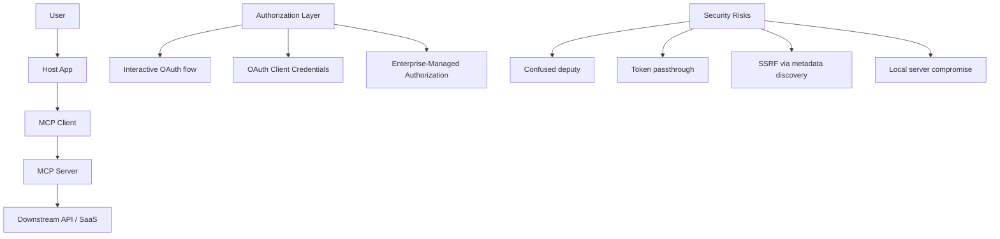

- [Understanding Authorization in MCP](https://modelcontextprotocol.io/docs/tutorials/security/authorization) - Official end-to-end authorization flow explanation.
- [Authorization Extensions](https://modelcontextprotocol.io/extensions/auth/overview) - Official overview of auth extensions beyond the core interactive flow.
- [OAuth Client Credentials](https://modelcontextprotocol.io/extensions/auth/oauth-client-credentials) - Official machine-to-machine auth extension.
- [Enterprise-Managed Authorization](https://modelcontextprotocol.io/extensions/auth/enterprise-managed-authorization) - Official enterprise IdP-based access-control extension.
- [Security Best Practices](https://modelcontextprotocol.io/docs/tutorials/security/security_best_practices) - Official security risks and mitigations, including confused deputy, token passthrough, and SSRF.

## OAuth and Authorization Flow

For remote MCP servers, the practical model is: discover the protected resource, discover the authorization server, complete OAuth, then use the resulting token to reach MCP capabilities.

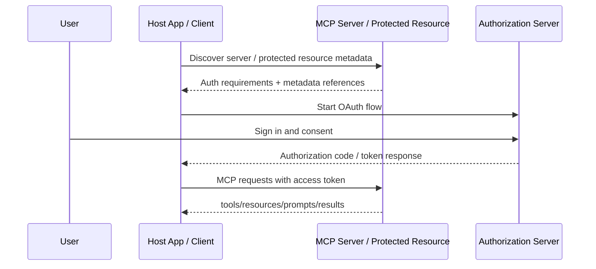

This is where many implementation mistakes happen. A secure client should keep tokens scoped, validate metadata, avoid token passthrough, and make consent boundaries explicit.

## Tasks for Long-Running Work

Tasks are an extension for operations that should not block the connection until completion. Typical examples include CI jobs, batch imports, human approvals, or any workflow that can move through `working`, `input_required`, `completed`, `failed`, or `cancelled`.

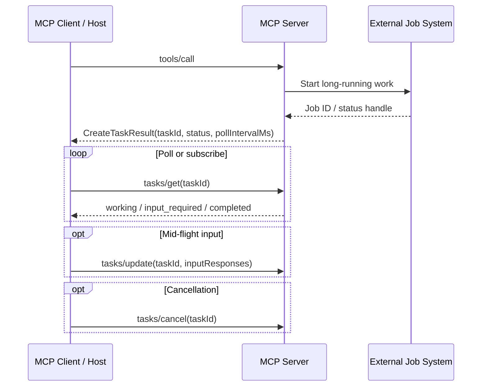

Tasks matter because they provide durable handles, progress visibility, reconnect-friendly polling, and a standard way to request additional input mid-flight.

## MCP Apps Rendering Model

MCP Apps let a tool reference an interactive UI resource that renders inside the host rather than returning only plain text.

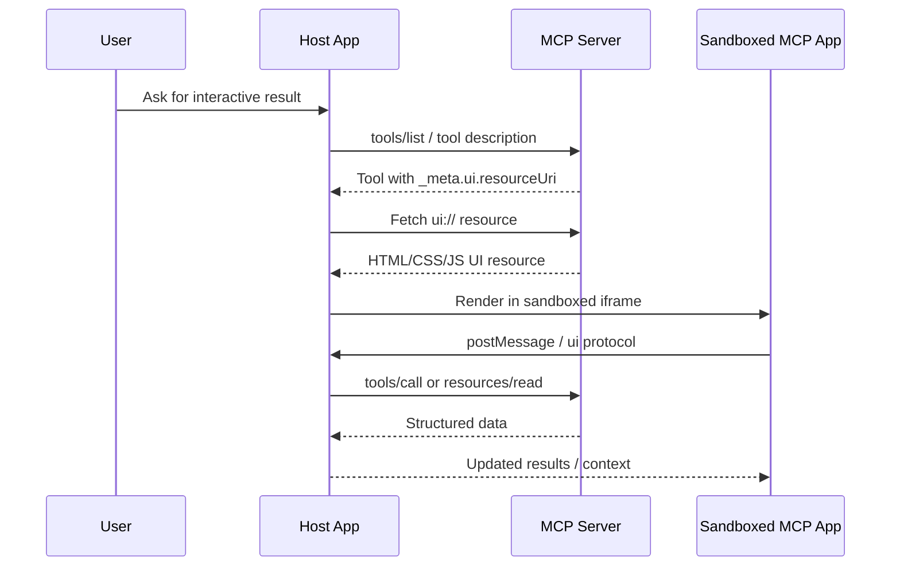

The key property is that the app stays sandboxed while still being able to request host-mediated tool calls and state updates.

## How to Evaluate an MCP Server

Not every MCP server should be installed just because it exists. A practical evaluation checklist helps filter low-quality or risky entries.

1. Scope fit: Is the server directly relevant to the workflow or domain you care about?
2. Capability clarity: Does it clearly expose tools, resources, prompts, or tasks with understandable schemas?
3. Trustworthiness: Is it official, maintained, or at least transparent about ownership and source code?
4. Installability: Are the package source, runtime, env vars, and auth requirements explicit?
5. Security posture: Does it minimize permissions, avoid unsafe defaults, and document auth and network behavior?
6. Operational quality: Are there examples, logs, debugging support, and compatibility notes for common clients?
7. Ecosystem alignment: Does it follow current MCP docs, registry conventions, and extension negotiation patterns?

The official design philosophy behind MCP is also useful when judging ecosystem projects:

- [Design Principles](https://modelcontextprotocol.io/community/design-principles) - Official principles such as convergence over choice, composability over specificity, and interoperability over optimization.

## Reading Guide for This List

To make the list easier to scan, read entries with these informal categories in mind:

- `Official`: maintained by the MCP project itself or the product vendor that owns the integration.
- `Production-oriented`: suitable for real workflows, deployment, or enterprise integration.
- `Community`: useful ecosystem projects maintained outside the official organization.
- `Archived`: historically important, still useful for reference, but not the main forward path.

In general, prefer current official docs first, then official SDKs and servers, then production-grade vendor integrations, then community frameworks and collections.

## MCP vs API, Function Calling, and Plugins

MCP is easiest to place correctly when compared with adjacent patterns:

- Traditional API integration: your application manually wires every API, auth flow, schema, and runtime behavior.
- Function calling: the model can call declared tools, but the tool contract is usually app-specific and not portable across hosts.
- Plugin-style ecosystems: integrations are often tied to one product platform and one packaging model.
- MCP: a cross-host protocol for discovering and invoking tools, reading resources, loading prompts, negotiating extensions, and optionally embedding apps.

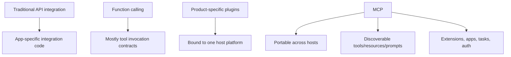

MCP does not replace APIs. It standardizes how AI hosts and external capability providers talk about those APIs and expose them safely to model-driven workflows.

## Terminology Map

These terms are easy to mix up, especially because “client” and “host” mean different things in other ecosystems.

| Term | Meaning in MCP | Practical interpretation |
| --- | --- | --- |
| Host | The AI application coordinating MCP connections | Claude, ChatGPT, VS Code, Cursor, custom agent app |
| Client | The protocol-side connection manager created by the host | The MCP-speaking component inside the host |
| Server | The program exposing tools, resources, prompts, and extensions | A local process or remote service |
| Tool | An action that can be invoked | Search, fetch, write, deploy, analyze |
| Resource | Readable context from the server | Files, docs, records, dashboards, media |
| Prompt | A reusable prompt template exposed by the server | Guided workflows and parameterized prompts |
| App | An interactive UI rendered inside a supporting host | Dashboard, form, viewer, workflow UI |
| Registry | Metadata catalog for discovering installable servers | Not the package payload itself |
| Root | Client-provided scope boundary | Allowed workspace directories or focus area |
| Sampling | Server asks host to get model output | Model access without bundling an LLM provider |
| Elicitation | Server asks host for extra user input | Human-in-the-loop follow-up |
| Task | Durable handle for long-running work | Pollable async job with progress |

## What a Production-Grade MCP Server Should Have

If you are building or curating serious MCP servers, these are the traits that matter most:

1. Clear capability schemas for tools, resources, prompts, and optional extensions.
2. Explicit auth model, permission scope, and downstream system boundaries.
3. Safe defaults for file access, network access, and side effects.
4. Strong installation and configuration documentation.
5. Support for local debugging and observable runtime behavior.
6. Graceful handling of long-running work, retries, and partial failures.
7. Versioning discipline and compatibility notes for clients.
8. Registry-ready metadata when distribution is part of the plan.

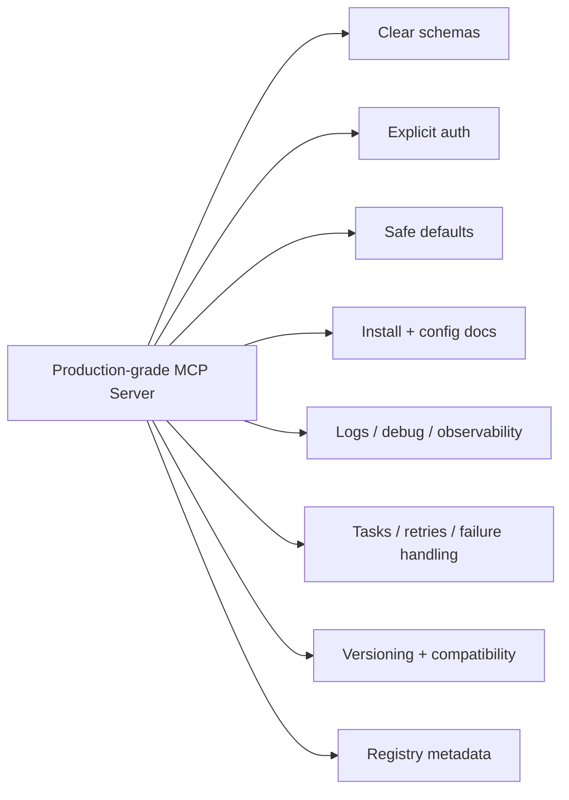

This is also a good checklist for deciding whether a community project belongs near the top of an awesome list or only in a secondary ecosystem section.

## Contents

- [Official Resources](#official-resources)
- [Quick Start Paths](#quick-start-paths)
- [Read by Audience](#read-by-audience)
- [How MCP Works](#how-mcp-works)
- [Core Concepts](#core-concepts)
- [Local vs Remote Servers](#local-vs-remote-servers)
- [Extensions and Advanced Capabilities](#extensions-and-advanced-capabilities)
- [Initialization Handshake](#initialization-handshake)
- [Registry Ecosystem](#registry-ecosystem)
- [Protocol Method Cheat Sheet](#protocol-method-cheat-sheet)
- [Client Primitives](#client-primitives)
- [Auth and Security Boundaries](#auth-and-security-boundaries)
- [OAuth and Authorization Flow](#oauth-and-authorization-flow)
- [Tasks for Long-Running Work](#tasks-for-long-running-work)
- [MCP Apps Rendering Model](#mcp-apps-rendering-model)
- [How to Evaluate an MCP Server](#how-to-evaluate-an-mcp-server)
- [Reading Guide for This List](#reading-guide-for-this-list)
- [MCP vs API, Function Calling, and Plugins](#mcp-vs-api-function-calling-and-plugins)
- [Terminology Map](#terminology-map)
- [What a Production-Grade MCP Server Should Have](#what-a-production-grade-mcp-server-should-have)
- [Servers](#servers)
- [Clients](#clients)
- [SDKs and Frameworks](#sdks-and-frameworks)
- [Tools and Infrastructure](#tools-and-infrastructure)
- [Registries and Discovery](#registries-and-discovery)
- [Tutorials and Learning Resources](#tutorials-and-learning-resources)
- [Example Collections](#example-collections)
- [Security, Auth, and Governance](#security-auth-and-governance)
- [Deployment and Operations](#deployment-and-operations)
- [Use Cases and Case Studies](#use-cases-and-case-studies)
- [Community Resources](#community-resources)
- [Contributing](#contributing)
- [Related Documents](#related-documents)

## Official Resources

Core specifications, standards, and official documentation that define the protocol and its intended behavior.

- [Model Context Protocol Documentation](https://modelcontextprotocol.io/docs/getting-started/intro) - Official introduction and documentation hub for MCP concepts, guides, and references.
- [Model Context Protocol GitHub Organization](https://github.com/modelcontextprotocol) - Official organization hosting the specification, SDKs, maintained servers, and related projects.
- [Architecture Overview](https://modelcontextprotocol.io/docs/learn/architecture) - Official architecture and protocol model overview.
- [Understanding MCP Servers](https://modelcontextprotocol.io/docs/learn/server-concepts) - Official guide to tools, resources, prompts, and server behavior.
- [Understanding MCP Clients](https://modelcontextprotocol.io/docs/learn/client-concepts) - Official guide to host applications, clients, roots, elicitation, and sampling.
- [Versioning](https://modelcontextprotocol.io/docs/learn/versioning) - Official versioning model for MCP protocol evolution.
- [Extensions Overview](https://modelcontextprotocol.io/extensions/overview) - Official entry point for optional protocol extensions.
- [MCP Apps](https://modelcontextprotocol.io/extensions/apps/overview) - Official extension overview for interactive UI apps rendered inside MCP hosts.
- [SEPs](https://modelcontextprotocol.io/seps) - Specification Enhancement Proposals for protocol evolution.

## Servers

MCP servers expose tools, resources, prompts, or structured capabilities to clients and agent systems.

### General-Purpose Servers

- [Model Context Protocol Servers](https://github.com/modelcontextprotocol/servers) - Official reference server collection maintained by the MCP project.
- [Everything](https://github.com/modelcontextprotocol/servers/tree/main/src/everything) - Official reference and test server that exercises prompts, resources, tools, sampling, and related protocol features.
- [Filesystem](https://github.com/modelcontextprotocol/servers/tree/main/src/filesystem) - Official filesystem server with dynamic directory access control via Roots.
- [Git](https://github.com/modelcontextprotocol/servers/tree/main/src/git) - Official Git workflow server for repository exploration and actions.
- [Fetch](https://github.com/modelcontextprotocol/servers/tree/main/src/fetch) - Official web fetch server for converting pages into LLM-friendly markdown.
- [Time](https://github.com/modelcontextprotocol/servers/tree/main/src/time) - Official server for current time lookup and timezone conversion.

### Productivity and Knowledge Servers

- [Memory](https://github.com/modelcontextprotocol/servers/tree/main/src/memory) - Official knowledge-graph-style persistent memory server for entities, relations, and observations.

### Data and Research Servers

- [PostgreSQL](https://github.com/modelcontextprotocol/servers-archived/tree/main/src/postgres) - Archived official server for read-only PostgreSQL access with schema inspection and query execution.

### Domain-Specific Servers

- [GitHub MCP Server](https://github.com/github/github-mcp-server) - Production-oriented official GitHub server for repositories, issues, pull requests, actions, code analysis, and workflow automation.
- [Google Drive](https://github.com/modelcontextprotocol/servers-archived/tree/main/src/gdrive) - Archived official server for listing, reading, and searching Google Drive files.
- [Google Maps](https://github.com/modelcontextprotocol/servers-archived/tree/main/src/google-maps) - Archived official server for maps, geocoding, place search, and routing workflows.
- [Slack](https://github.com/modelcontextprotocol/servers-archived/tree/main/src/slack) - Archived official Slack API server for channel listing, messaging, and workspace interaction.
- [Puppeteer](https://github.com/modelcontextprotocol/servers-archived/tree/main/src/puppeteer) - Archived official browser automation server for navigation, screenshots, and page interaction.

## Clients

MCP clients consume server capabilities and expose them to users, assistants, or agent runtimes.

### End-User Clients

- [Claude Connectors Documentation](https://claude.com/docs/connectors/building) - Production-oriented official Anthropic documentation for MCP-based connectors in Claude.
- [OpenAI MCP Docs](https://developers.openai.com/api/docs/mcp) - Production-oriented official OpenAI documentation for MCP in ChatGPT apps and API integrations.
- [VS Code MCP Support](https://code.visualstudio.com/docs/agent-customization/mcp-servers) - Production-oriented official Visual Studio Code documentation for MCP server management.
- [MCPJam Inspector](https://docs.mcpjam.com/getting-started) - Community client and inspection surface with web, terminal, and desktop workflows.

### Agent and Runtime Clients

- [OpenAI Agents SDK MCP Integration](https://openai.github.io/openai-agents-python/mcp/) - Official OpenAI Agents SDK guide for integrating hosted, HTTP, SSE, and stdio MCP servers.
- [Build an MCP Client](https://modelcontextprotocol.io/docs/develop/build-client) - Official MCP guide for building client implementations.
- [Client Best Practices](https://modelcontextprotocol.io/docs/develop/clients/client-best-practices) - Official guidance for scaling host applications across many servers and tools.

## SDKs and Frameworks

Libraries and frameworks for building MCP servers, clients, transports, and higher-level integrations.

### Official SDKs

- [SDK Overview](https://modelcontextprotocol.io/docs/sdk) - Official SDK index with tiering information and language coverage.
- [TypeScript SDK](https://github.com/modelcontextprotocol/typescript-sdk) - Official Tier 1 TypeScript SDK for MCP servers and clients.
- [Python SDK](https://github.com/modelcontextprotocol/python-sdk) - Official Tier 1 Python SDK for MCP servers and clients.
- [C# SDK](https://github.com/modelcontextprotocol/csharp-sdk) - Official Tier 1 C# SDK for MCP development.
- [Go SDK](https://github.com/modelcontextprotocol/go-sdk) - Official Tier 1 Go SDK for MCP development.
- [Java SDK](https://github.com/modelcontextprotocol/java-sdk) - Official Tier 2 Java SDK.
- [Rust SDK](https://github.com/modelcontextprotocol/rust-sdk) - Official Tier 2 Rust SDK.
- [Swift SDK](https://github.com/modelcontextprotocol/swift-sdk) - Official Swift SDK.
- [Ruby SDK](https://github.com/modelcontextprotocol/ruby-sdk) - Official Ruby SDK.
- [PHP SDK](https://github.com/modelcontextprotocol/php-sdk) - Official PHP SDK.
- [Kotlin SDK](https://github.com/modelcontextprotocol/kotlin-sdk) - Official Kotlin SDK.

### Community SDKs

- [FastMCP](https://github.com/punkpeye/fastmcp) - Popular TypeScript framework built on top of the official SDK for rapid MCP server development.
- [MCP Framework](https://www.mcp-framework.com/) - TypeScript framework focused on an expressive API and fast server scaffolding.
- [Spring AI MCP Server Boot Starter](https://docs.spring.io/spring-ai/reference/api/mcp/mcp-server-boot-starter-docs.html) - Production-oriented Spring AI support for wiring MCP servers into Spring Boot applications.
- [Spring AI MCP Client](https://docs.spring.io/spring-ai/reference/api/mcp/) - Production-oriented Spring AI support for MCP client functionality in Java applications.
- [Vercel MCP Handler](https://github.com/vercel/mcp-handler) - Production-oriented adapter for serving MCP endpoints from Next.js, Nuxt, Svelte, and related JavaScript frameworks.

### Higher-Level Frameworks

- [OpenAI Agents SDK MCP](https://openai.github.io/openai-agents-python/mcp/) - Official OpenAI framework integration for MCP-aware agent workflows.
- [MCP-Agent](https://github.com/lastmile-ai/mcp-agent) - Framework for building agents around MCP using composable workflow patterns.

## Tools and Infrastructure

Supporting tools that improve development, debugging, reliability, and interoperability across the ecosystem.

### Development and Debugging

- [MCP Inspector](https://modelcontextprotocol.io/docs/tools/inspector) - Official interactive developer tool for testing and debugging MCP servers.
- [Debugging Guide](https://modelcontextprotocol.io/docs/tools/debugging) - Official end-to-end debugging guide for MCP integrations.
- [MCPJam Inspector](https://docs.mcpjam.com/getting-started) - Dedicated MCP inspector with hosted, terminal, and desktop workflows.
- [Everything Reference Server](https://github.com/modelcontextprotocol/servers/tree/main/src/everything) - Official all-features test server for validating client behavior.
- [MCPCLIHost](https://github.com/vincent-pli/mcp-cli-host) - Community CLI host application with support for multiple MCP servers, tracing, prompts, roots, elicitation, and sampling.
- [OpenMCP Client](https://github.com/LSTM-Kirigaya/openmcp-client/) - VS Code-focused MCP debugging client and developer toolset.

### Gateway and Interoperability Tools

- [MCPProxy](https://github.com/smart-mcp-proxy/mcpproxy-go) - Multi-server MCP proxy focused on tool discovery, federation, and security quarantine for untrusted tools.
- [Vercel MCP Handler](https://github.com/vercel/mcp-handler) - Framework adapter for exposing MCP servers over web-friendly application runtimes.
- [Higress MCP Server Hosting](https://github.com/higress-group/higress/tree/main/plugins/wasm-go/mcp-servers) - Gateway-oriented hosting approach for MCP servers based on Higress and Envoy extensions.

### Observability and Reliability

- [Debugging Guide](https://modelcontextprotocol.io/docs/tools/debugging) - Official guidance covering logging, common failures, connection issues, and debugging workflows.
- [OpenAI Agents SDK MCP Integration](https://openai.github.io/openai-agents-python/mcp/) - Includes official tracing guidance for MCP activity inside agent workflows.
- [MCPJam Inspector](https://docs.mcpjam.com/getting-started) - Supports Chat / Trace / Raw inspection views, OAuth debugging, and side-by-side model comparison for MCP development.
- [MCPProxy](https://github.com/smart-mcp-proxy/mcpproxy-go) - Adds activity logging, quarantine, and security scanning around federated MCP deployments.

## Registries and Discovery

Resources that help users discover, compare, and evaluate MCP-compatible projects.

- [Official MCP Registry](https://registry.modelcontextprotocol.io/) - Official registry for discovering published MCP servers.
- [About the MCP Registry](https://modelcontextprotocol.io/registry/about) - Official overview of the registry model and publishing workflow.
- [Registry Quickstart](https://modelcontextprotocol.io/registry/quickstart) - Official guide to publishing an MCP server to the registry.
- [Registry Aggregators](https://modelcontextprotocol.io/registry/registry-aggregators) - Official documentation for registry aggregation and downstream distribution.
- [Extension Support Matrix](https://modelcontextprotocol.io/extensions/client-matrix) - Official matrix showing which clients implement which official extensions.
- [Package Types](https://modelcontextprotocol.io/registry/package-types) - Official guide to the package and distribution formats supported by the registry.
- [punkpeye/awesome-mcp-servers](https://github.com/punkpeye/awesome-mcp-servers) - Large community-maintained collection of MCP servers.
- [wong2/awesome-mcp-servers](https://github.com/wong2/awesome-mcp-servers) - Curated community list of MCP servers with broad coverage across domains.
- [MCP Repository](https://mcprepository.com/) - Discovery site for browsing and searching MCP servers.

## Tutorials and Learning Resources

Learning material for developers, maintainers, and advanced users adopting MCP.

- [Build an MCP Server](https://modelcontextprotocol.io/docs/develop/build-server) - Official getting-started guide for implementing an MCP server.
- [Connect to Local MCP Servers](https://modelcontextprotocol.io/docs/develop/connect-local-servers) - Official guide for local server connections.
- [Connect to Remote MCP Servers](https://modelcontextprotocol.io/docs/develop/connect-remote-servers) - Official guide for remote MCP server connections.
- [Build with Agent Skills](https://modelcontextprotocol.io/docs/develop/build-with-agent-skills) - Official guide for using agent skills when designing or implementing servers.
- [Build an MCP App](https://modelcontextprotocol.io/extensions/apps/build) - Official guide for building interactive MCP Apps.
- [Claude Custom Connector Guide](https://claude.com/docs/connectors/building) - Official Anthropic guide for production-facing MCP integrations in Claude.

## Example Collections

Reference examples that show how MCP is used in practice.

- [Example Servers](https://modelcontextprotocol.io/examples) - Official collection page for reference servers and implementation examples.
- [Everything](https://github.com/modelcontextprotocol/servers/tree/main/src/everything) - Official full-feature example server for broad protocol coverage.
- [Sequential Thinking](https://github.com/modelcontextprotocol/servers/tree/main/src/sequentialthinking) - Official example server focused on stepwise reasoning workflows.
- [MCP Apps Examples](https://modelcontextprotocol.io/extensions/apps/overview) - Official overview linking to interactive app examples such as dashboards, viewers, and workflow UIs.

## Security, Auth, and Governance

Resources covering trust boundaries, identity, authorization, and safe protocol operation.

- [Security Best Practices](https://modelcontextprotocol.io/docs/tutorials/security/security_best_practices) - Official guidance on attack vectors and secure MCP implementation patterns.
- [Understanding Authorization in MCP](https://modelcontextprotocol.io/docs/tutorials/security/authorization) - Official OAuth 2.1 authorization guidance for MCP servers.
- [Authorization Extensions](https://modelcontextprotocol.io/extensions/auth/overview) - Official overview of supplementary authorization mechanisms.
- [Enterprise-Managed Authorization](https://modelcontextprotocol.io/extensions/auth/enterprise-managed-authorization) - Official extension for centralized enterprise access control.
- [OAuth Client Credentials](https://modelcontextprotocol.io/extensions/auth/oauth-client-credentials) - Official machine-to-machine auth extension guidance.
- [Security Policy](https://modelcontextprotocol.io/community/security) - Official vulnerability reporting and disclosure coordination policy.
- [SEP-1024: Client Security Requirements for Local Server Installation](https://modelcontextprotocol.io/seps/1024-mcp-client-security-requirements-for-local-server-) - Official proposal covering client security requirements for local server installation.

## Deployment and Operations

Resources for packaging, hosting, scaling, and maintaining MCP systems in real environments.

- [Publishing Remote Servers](https://modelcontextprotocol.io/registry/remote-servers) - Official registry guidance for publishing remotely hosted servers.
- [How to Automate Publishing with GitHub Actions](https://modelcontextprotocol.io/registry/github-actions) - Official CI workflow guidance for registry publication.
- [Versioning Published MCP Servers](https://modelcontextprotocol.io/registry/versioning) - Official guide to versioning servers in the registry.
- [Feature Lifecycle and Deprecation Policy](https://modelcontextprotocol.io/community/feature-lifecycle) - Official lifecycle guidance for protocol features and compatibility planning.
- [Roadmap](https://modelcontextprotocol.io/development/roadmap) - Official roadmap for protocol evolution and ecosystem workstreams.
- [Vercel MCP Handler](https://github.com/vercel/mcp-handler) - Deployment-oriented adapter for serving MCP endpoints from app frameworks.
- [Higress MCP Server Hosting](https://github.com/higress-group/higress/tree/main/plugins/wasm-go/mcp-servers) - API-gateway-oriented hosting approach for MCP services.
- [MCPProxy](https://github.com/smart-mcp-proxy/mcpproxy-go) - Operational layer for federating many MCP servers behind one proxy with security controls.

## Use Cases and Case Studies

Resources showing MCP applied to concrete tasks, products, or workflows.

- [VS Code MCP Support](https://code.visualstudio.com/docs/agent-customization/mcp-servers) - IDE workflow example for connecting coding agents to external tools and data.
- [OpenAI MCP Docs](https://developers.openai.com/api/docs/mcp) - Official OpenAI usage patterns for ChatGPT apps and API integrations.
- [Claude Custom Connector Guide](https://claude.com/docs/connectors/building) - Official Claude workflow for turning product and data integrations into MCP-based connectors.
- [GitHub MCP Server](https://github.com/github/github-mcp-server) - Concrete product integration showing repository, PR, issue, and workflow automation over MCP.
- [MCP Apps](https://modelcontextprotocol.io/extensions/apps/overview) - Product-oriented pattern for embedding dashboards, forms, media viewers, and multi-step interfaces directly inside MCP hosts.

## Community Resources

Resources that help the ecosystem stay discoverable and maintainable.

- [MCP GitHub Discussions](https://github.com/modelcontextprotocol) - Official GitHub organization and discussion entry point for maintained repositories.
- [Governance and Stewardship](https://modelcontextprotocol.io/community/governance) - Official governance overview for the MCP project.
- [Working and Interest Groups](https://modelcontextprotocol.io/community/working-interest-groups) - Official map of active working groups and interest groups across the ecosystem.
- [Contributor Communication](https://modelcontextprotocol.io/community/communication) - Official communication structure for contributors and community participants.
- [Roadmap](https://modelcontextprotocol.io/development/roadmap) - Official view of current priority areas such as transport scalability, agent communication, governance maturation, and enterprise readiness.

## Contributing

Contributions are welcome, especially when they improve coverage without reducing quality.

- Read the contribution guide: [CONTRIBUTING.md](../CONTRIBUTING.md)
- Review inclusion rules: [docs/curation-policy.md](../docs/curation-policy.md)
- Follow the entry format: [docs/resource-template.md](../docs/resource-template.md)
- Check link quality regularly: [docs/link-check.md](../docs/link-check.md)

Please prefer official and verifiable sources whenever possible.

## Related Documents

- Chinese README: [README.zh-CN.md](README.zh-CN.md)
- MCP primer: [docs/mcp-primer.md](docs/mcp-primer.md)
- MCP primer in Chinese: [docs/mcp-primer.zh-CN.md](docs/mcp-primer.zh-CN.md)
- Release checklist: [docs/release-checklist.md](docs/release-checklist.md)
- Release checklist in Chinese: [docs/release-checklist.zh-CN.md](docs/release-checklist.zh-CN.md)
- Contribution guide in Chinese: [CONTRIBUTING.zh-CN.md](../CONTRIBUTING.zh-CN.md)
- Curation policy in Chinese: [docs/curation-policy.zh-CN.md](../docs/curation-policy.zh-CN.md)
- Resource template in Chinese: [docs/resource-template.zh-CN.md](../docs/resource-template.zh-CN.md)
- Link-check guide in Chinese: [docs/link-check.zh-CN.md](../docs/link-check.zh-CN.md)

## License

[MIT](../LICENSE)
