# MCP

一个围绕 Model Context Protocol（MCP）生态的分层式精选资源列表。

本仓库希望尽可能完整地覆盖 MCP 生态，同时保持结构清晰、收录标准严格、后续易于维护。收录范围包括官方规范、服务器、客户端、SDK、框架、工具、注册目录、教程、示例、安全治理、部署运维以及真实应用案例。

## 收录范围

本仓库聚焦所有与 MCP 直接相关的资源，包括：

- 官方 MCP 规范、文档与标准；
- 面向数据访问、开发工作流、生产力、研究和自动化的 MCP Servers；
- MCP Clients、宿主应用和 Agent 运行时；
- SDK、框架与集成库；
- Inspector、测试工具、网关、可观测性工具与部署基础设施；
- 注册目录、发现平台与精选集合；
- 教程、技术指南、参考实现与示例工程；
- 安全、认证、治理与运维实践；
- 基于 MCP 构建的真实应用与案例。

本仓库不以收集泛 AI 工具为目标，除非该资源与 MCP 的关系清晰且可以核验。

## 组织方式

本列表先按生态角色分层，再在层内按资源类型组织，避免把官方规范、运行时工具和应用案例混成一个扁平长列表。

## 快速阅读路径

如果你不想从头线性读完这份仓库，可以直接按目标走下面这些路径：

- 我只想先理解 MCP 是什么：
  先看 [MCP 入门说明](docs/mcp-primer.zh-CN.md)、[MCP 工作原理](#mcp-工作原理)、[核心概念](#核心概念)、[本地与远程模式](#本地与远程模式)。
- 我想开发 MCP Server：
  先看 [协议方法速览](#协议方法速览)、[如何评估 MCP Server](#如何评估-mcp-server)、[Build an MCP Server](https://modelcontextprotocol.io/docs/develop/build-server)、[SDK Overview](https://modelcontextprotocol.io/docs/sdk)。
- 我想把 MCP 集成进产品：
  先看 [认证与安全边界](#认证与安全边界)、[授权流程](#授权流程)、[MCP Apps 渲染模型](#mcp-apps-渲染模型)，再看目标 Host 对应的客户端文档。
- 我想找更接近生产可用的项目：
  从 [官方资源](#官方资源)、[注册目录与发现平台](#注册目录与发现平台)、[Clients](#clients)、[部署与运维](#部署与运维) 开始。
- 我想理解 MCP 的高级能力：
  先看 [扩展与高级能力](#扩展与高级能力)、[长任务机制](#长任务机制)、[MCP Apps 渲染模型](#mcp-apps-渲染模型)、[认证与安全边界](#认证与安全边界)。

## 按读者角色阅读

不同类型的读者，最该看的部分其实不一样：

- 应用使用者与提示工程用户：
  重点看 [MCP 工作原理](#mcp-工作原理)、[Clients](#clients)、[应用场景与案例](#应用场景与案例)、[注册目录与发现平台](#注册目录与发现平台)。
- Server 开发者：
  重点看 [核心概念](#核心概念)、[协议方法速览](#协议方法速览)、[客户端原语](#客户端原语)、[SDK 与框架](#sdk-与框架)、[工具与基础设施](#工具与基础设施)。
- Client / Host 实现者：
  重点看 [初始化握手](#初始化握手)、[扩展与高级能力](#扩展与高级能力)、[MCP Apps 渲染模型](#mcp-apps-渲染模型)、[认证与安全边界](#认证与安全边界)。
- 平台与企业团队：
  重点看 [认证与安全边界](#认证与安全边界)、[授权流程](#授权流程)、[部署与运维](#部署与运维)、[生产级 MCP Server 应具备的能力](#生产级-mcp-server-应具备的能力)。
- 生态维护者与精选列表整理者：
  重点看 [阅读这份列表的方式](#阅读这份列表的方式)、[如何评估 MCP Server](#如何评估-mcp-server)、[注册目录与发现平台](#注册目录与发现平台)、[社区资源](#社区资源)。

## MCP 工作原理

从整体上看，MCP 把宿主应用和外部系统解耦开来。宿主应用通过 MCP Client 与 MCP Server 通信，而 Server 以结构化方式暴露 tools、resources、prompts 等能力。

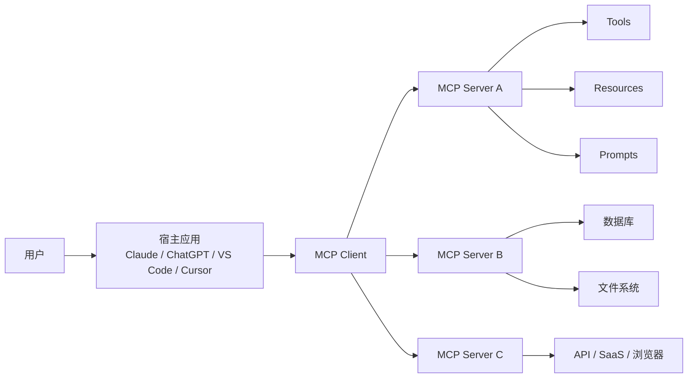

MCP 里最关键的三类协议原语是：

- `tools`：可被模型调用的动作；
- `resources`：可被读取的上下文内容；
- `prompts`：由 Server 暴露的可复用提示模板。

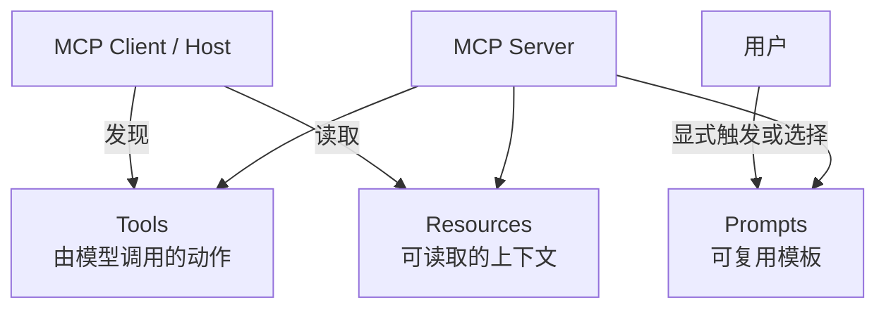

一次典型交互中，宿主应用会先发现能力，再决定读取哪些上下文，必要时让模型调用工具，最后把结果组织成用户可读的回答。

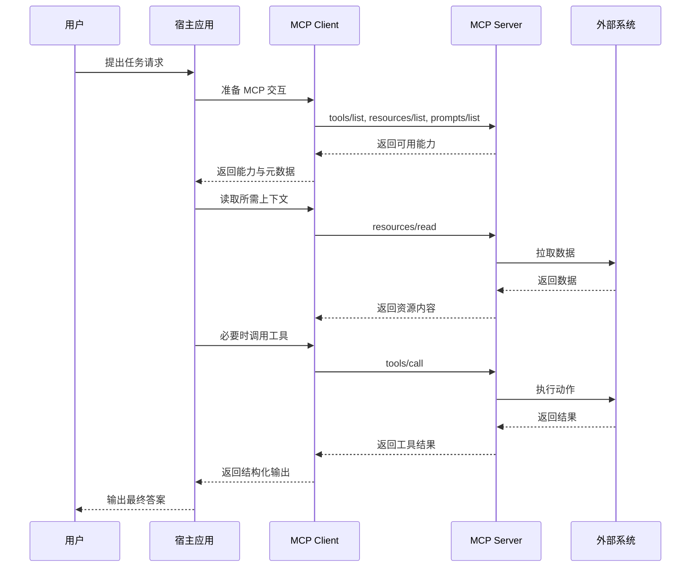

## 核心概念

理解 MCP 时，最有用的拆法是：参与方、协议层和原语。

- `MCP Host`：协调一个或多个 MCP 连接的 AI 应用。
- `MCP Client`：由 Host 为某个 Server 连接创建的协议组件。
- `MCP Server`：对外暴露上下文和能力的程序。
- `数据层`：基于 JSON-RPC 的协议层，负责初始化、能力协商、tools、resources、prompts、notifications 以及客户端原语。
- `传输层`：承载 MCP 消息的通信通道，最常见的是本地 `stdio` 和远程 Streamable HTTP。

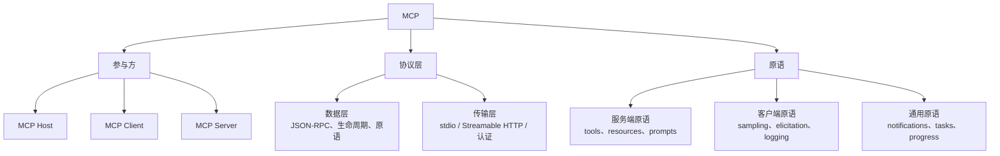

如果你想建立协议级的完整心智模型，最推荐先看官方 [Architecture Overview](https://modelcontextprotocol.io/docs/learn/architecture)。

## 本地与远程模式

本地 MCP Server 和远程 MCP Server 共享同一套数据层概念，但运行方式不同。

- 本地 Server 通常作为本机子进程运行，常见传输方式是 `stdio`。
- 远程 Server 通常通过网络提供服务，常见传输方式是 Streamable HTTP，并配合标准 Web 认证方式。

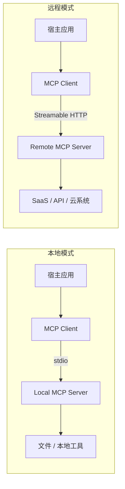

- [Connect to Local MCP Servers](https://modelcontextprotocol.io/docs/develop/connect-local-servers) - 官方本地 `stdio` 场景说明。
- [Connect to Remote MCP Servers](https://modelcontextprotocol.io/docs/develop/connect-remote-servers) - 官方远程连接器与 HTTP 场景说明。

## 扩展与高级能力

MCP 的基础协议本身保持精简，很多更复杂的能力通过官方扩展或可选原语来提供。

- [MCP Apps](https://modelcontextprotocol.io/extensions/apps/overview) - 在支持的 Host 中内嵌交互式 HTML 应用。
- [Tasks](https://modelcontextprotocol.io/extensions/tasks/overview) - 为长时间运行任务提供可轮询、可恢复、可中途补充输入的 durable handle。
- [Extension Support Matrix](https://modelcontextprotocol.io/extensions/client-matrix) - 官方客户端扩展支持矩阵。

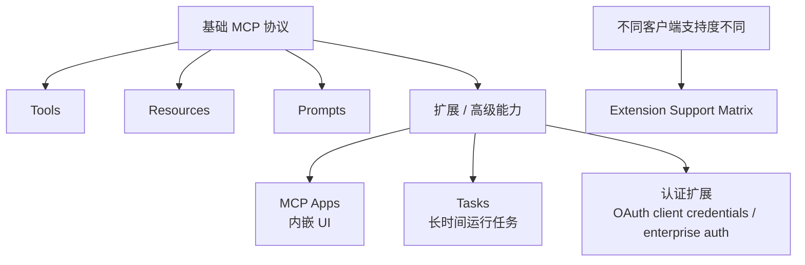

## 初始化握手

在真正执行 `list`、`read`、`call` 之前，Client 和 Server 会先完成一轮生命周期握手，用来确认协议版本兼容性并协商双方支持的能力。

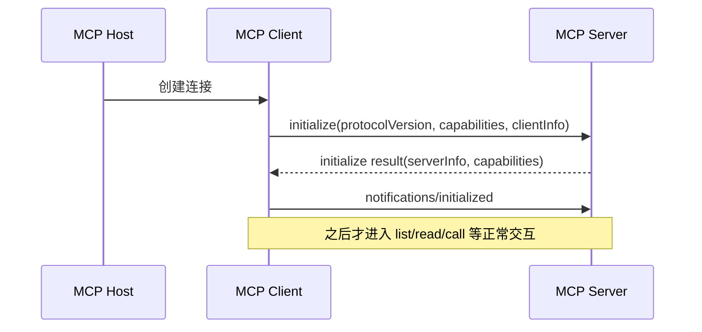

- [Architecture Overview](https://modelcontextprotocol.io/docs/learn/architecture) - 官方对生命周期管理、能力协商和通知机制的说明。
- [Extension Support Matrix](https://modelcontextprotocol.io/extensions/client-matrix) - 展示扩展能力如何建立在基础握手之上进行协商。

## 注册生态

MCP Registry 不是代码包仓库，而是面向 MCP Server 的元数据层。它负责描述 Server 在哪里、如何安装、具备什么能力。

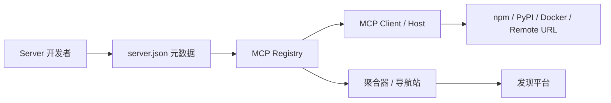

- [The MCP Registry](https://modelcontextprotocol.io/registry/about) - 官方对 Registry 作为集中式元数据仓库的说明。
- [Package Types](https://modelcontextprotocol.io/registry/package-types) - 官方支持的安装与打包格式说明。

## 协议方法速览

从协议层看，大多数 MCP 交互都可以归结为少量的发现、读取、调用、更新方法。

- 服务端发现：
  `tools/list`、`resources/list`、`resources/templates/list`、`prompts/list`
- 服务端使用：
  `tools/call`、`resources/read`、`prompts/get`
- 生命周期：
  `initialize`、`notifications/initialized`
- 客户端原语：
  `sampling/createMessage`、`elicitation/create`
- 长任务：
  `tasks/get`、`tasks/update`、`tasks/cancel`

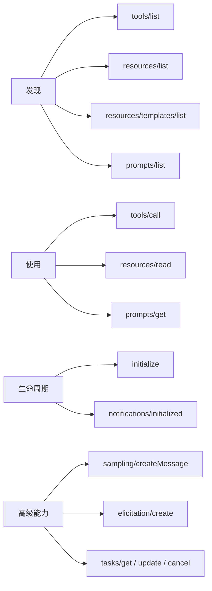

## 客户端原语

MCP 不只是“Server 能暴露什么”，也包括“Client 能提供什么”。这些客户端原语决定了同一个 Server 在不同 Host 上的体验差异。

- `sampling`：Server 可以请求 Host 代为获取模型输出，而不必自己内嵌模型 SDK。
- `elicitation`：Server 可以向用户追问信息或请求确认。
- `logging`：Server 可以把日志发送给 Client，用于调试和观测。
- `roots`：Client 可以限定 Server 关注的工作区范围。

## 认证与安全边界

MCP 的安全核心，在于维护用户、Host、Client、Server 和下游系统之间的信任边界。

- 标准交互式认证基于 OAuth 2.0 授权模式。
- 远程 Server 往往先暴露 protected resource metadata 和 authorization server metadata，Client 才能完成认证流程。
- 机器到机器、企业级统一权限控制等场景，通过官方认证扩展来处理。
- Host 和 Proxy 需要避免一些高风险反模式，比如 token passthrough、过宽 scope、弱 redirect 校验，以及 metadata discovery 触发的 SSRF。

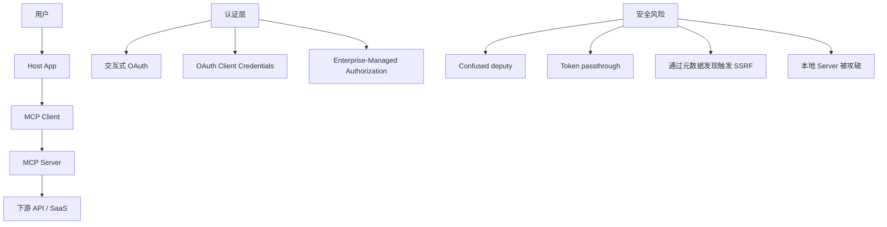

- [Understanding Authorization in MCP](https://modelcontextprotocol.io/docs/tutorials/security/authorization) - 官方完整授权流程说明。
- [Authorization Extensions](https://modelcontextprotocol.io/extensions/auth/overview) - 官方认证扩展总览。
- [OAuth Client Credentials](https://modelcontextprotocol.io/extensions/auth/oauth-client-credentials) - 官方机器到机器认证扩展。
- [Enterprise-Managed Authorization](https://modelcontextprotocol.io/extensions/auth/enterprise-managed-authorization) - 官方企业 IdP 统一接管访问控制的扩展。
- [Security Best Practices](https://modelcontextprotocol.io/docs/tutorials/security/security_best_practices) - 官方安全风险与缓解说明，覆盖 confused deputy、token passthrough、SSRF 等问题。

## 授权流程

对远程 MCP Server 来说，最实用的理解方式是：先发现受保护资源，再发现授权服务器，完成 OAuth，最后带着 token 去访问 MCP 能力。

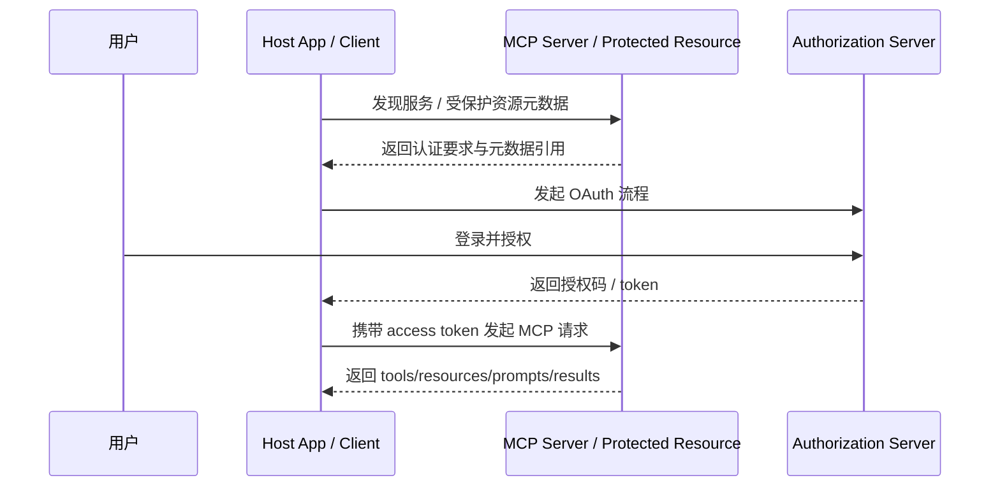

这一层最容易出错。安全实现通常要求：token 最小权限化、严格校验元数据、避免 token passthrough、把用户 consent 边界做清楚。

## 长任务机制

Tasks 扩展适合那些不应该一直阻塞连接直到完成的操作，例如 CI、批处理、人工审批，或者任何会经历 `working`、`input_required`、`completed`、`failed`、`cancelled` 状态的工作流。

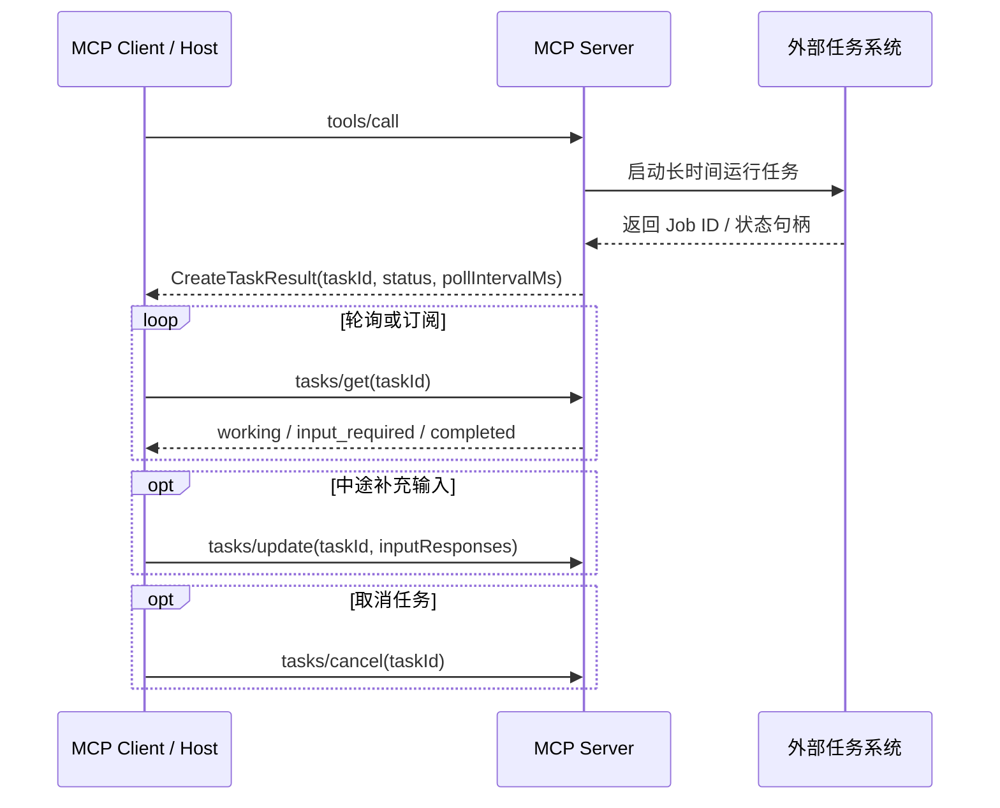

Tasks 的价值在于：可持久恢复的任务句柄、进度可见性、断线重连后继续轮询，以及中途补充输入的标准机制。

## MCP Apps 渲染模型

MCP Apps 让工具不只返回文本结果，还能引用一个交互式 UI 资源，在 Host 内部直接渲染。

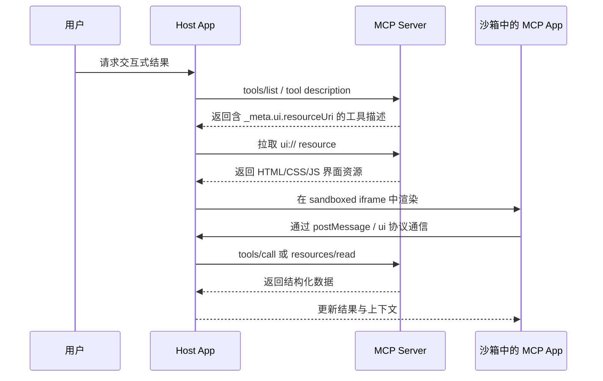

它的关键价值在于：应用被安全隔离在沙箱里，但仍然可以通过 Host 受控地请求工具调用和上下文更新。

## 如何评估 MCP Server

MCP Server 不是越多越好。真正可用的索引，应该告诉读者如何筛选质量、风险和适配度。

1. 范围匹配：它是否直接服务于你的工作流或领域？
2. 能力清晰：它暴露的 tools、resources、prompts、tasks 是否有清晰 schema 和说明？
3. 可信度：它是否官方、持续维护，或者至少明确公开了作者与源码？
4. 可安装性：包来源、运行时、环境变量、认证要求是否明确？
5. 安全姿态：权限是否最小化，默认行为是否安全，是否解释了认证和网络访问边界？
6. 运维质量：是否提供示例、日志、调试方法和常见客户端兼容性说明？
7. 生态一致性：是否遵循当前 MCP 文档、Registry 约定和扩展协商方式？

官方设计原则也很适合作为评估生态项目时的参考：

- [Design Principles](https://modelcontextprotocol.io/community/design-principles) - 官方设计原则，包括 convergence over choice、composability over specificity、interoperability over optimization 等。

## 阅读这份列表的方式

为了让列表更容易扫描，可以把条目大致按下面几类心里标记来理解：

- `Official`：由 MCP 官方项目或集成所属产品官方维护。
- `Production-oriented`：明显面向真实工作流、部署或企业集成。
- `Community`：由官方组织之外的生态维护者提供。
- `Archived`：有参考价值，但已经不是主要前进方向。

通常建议的阅读顺序是：先看当前官方文档，再看官方 SDK 与官方服务器，再看生产级厂商集成，最后再看社区框架和大型集合目录。

## MCP 与其他集成方式的区别

要把 MCP 放对位置，最简单的办法就是拿它和相邻模式做对比：

- 传统 API 集成：应用自己手动处理每个 API 的认证、schema、调用方式和运行逻辑。
- Function calling：模型可以调用工具，但工具契约通常是某个应用内部定义的，不具备跨 Host 可移植性。
- Plugin 式生态：集成通常绑定在某一个产品平台和它自己的打包方式上。
- MCP：一种跨 Host 的协议，用来发现和调用 tools、读取 resources、加载 prompts、协商扩展能力，必要时还可以嵌入 Apps。

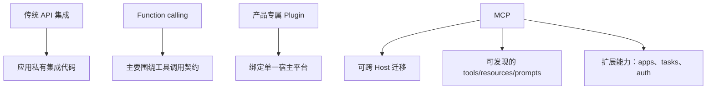

MCP 并不是替代 API，而是把“AI Host 如何理解并安全调用这些外部能力”标准化。

## 术语对照表

这些术语很容易混淆，尤其是 `client` 和 `host` 在其他生态里往往不是这个含义。

| 术语 | MCP 中的含义 | 实际理解 |
| --- | --- | --- |
| Host | 协调 MCP 连接的 AI 应用 | Claude、ChatGPT、VS Code、Cursor、自定义 Agent 应用 |
| Client | 由 Host 创建的协议连接组件 | Host 内部真正“说 MCP”的那一层 |
| Server | 暴露 tools、resources、prompts、extensions 的程序 | 本地进程或远程服务 |
| Tool | 可被调用的动作 | 搜索、抓取、写入、部署、分析 |
| Resource | 可被读取的上下文 | 文件、文档、记录、仪表盘、媒体 |
| Prompt | Server 暴露的可复用提示模板 | 带参数的引导式工作流 |
| App | 在支持的 Host 中渲染的交互式 UI | Dashboard、表单、查看器、工作流界面 |
| Registry | 用于发现可安装 Server 的元数据目录 | 不是包本体 |
| Root | Client 提供的作用域边界 | 可访问目录或关注范围 |
| Sampling | Server 请求 Host 获取模型输出 | 不需要自己内嵌 LLM Provider |
| Elicitation | Server 请求 Host 进一步向用户取信息 | 人在环的追问/确认 |
| Task | 长任务的持久句柄 | 可轮询的异步任务 |

## 生产级 MCP Server 应具备的能力

如果你要构建或筛选严肃可用的 MCP Server，这些特征最重要：

1. tools、resources、prompts 以及可选 extensions 都有清晰 schema。
2. 认证模型、权限边界和下游系统边界都说得清楚。
3. 文件访问、网络访问和副作用行为默认安全。
4. 安装与配置文档完整。
5. 具备本地调试能力和可观测运行行为。
6. 能正确处理长任务、重试和部分失败。
7. 有版本管理纪律，并说明客户端兼容性。
8. 如果要分发，具备可进入 Registry 的元数据准备。

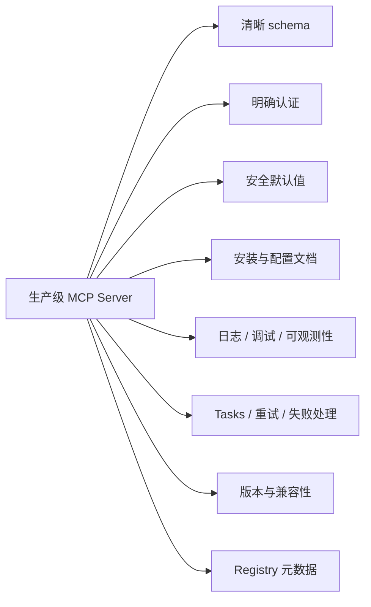

这也可以作为判断一个社区项目应该放在 awesome 列表核心区还是次级生态区的标准。

## 目录

- [官方资源](#官方资源)
- [快速阅读路径](#快速阅读路径)
- [按读者角色阅读](#按读者角色阅读)
- [MCP 工作原理](#mcp-工作原理)
- [核心概念](#核心概念)
- [本地与远程模式](#本地与远程模式)
- [扩展与高级能力](#扩展与高级能力)
- [初始化握手](#初始化握手)
- [注册生态](#注册生态)
- [协议方法速览](#协议方法速览)
- [客户端原语](#客户端原语)
- [认证与安全边界](#认证与安全边界)
- [授权流程](#授权流程)
- [长任务机制](#长任务机制)
- [MCP Apps 渲染模型](#mcp-apps-渲染模型)
- [如何评估 MCP Server](#如何评估-mcp-server)
- [阅读这份列表的方式](#阅读这份列表的方式)
- [MCP 与其他集成方式的区别](#mcp-与其他集成方式的区别)
- [术语对照表](#术语对照表)
- [生产级 MCP Server 应具备的能力](#生产级-mcp-server-应具备的能力)
- [Servers](#servers)
- [Clients](#clients)
- [SDK 与框架](#sdk-与框架)
- [工具与基础设施](#工具与基础设施)
- [注册目录与发现平台](#注册目录与发现平台)
- [教程与学习资源](#教程与学习资源)
- [示例集合](#示例集合)
- [安全、认证与治理](#安全认证与治理)
- [部署与运维](#部署与运维)
- [应用场景与案例](#应用场景与案例)
- [社区资源](#社区资源)
- [贡献方式](#贡献方式)
- [相关文档](#相关文档)

## 官方资源

用于定义协议行为与生态基础的核心规范、标准与官方文档。

- [Model Context Protocol Documentation](https://modelcontextprotocol.io/docs/getting-started/intro) - MCP 官方文档入口，覆盖概念、指南和参考资料。
- [Model Context Protocol GitHub Organization](https://github.com/modelcontextprotocol) - 官方 GitHub 组织，托管规范、SDK、维护中的服务器及相关项目。
- [Architecture Overview](https://modelcontextprotocol.io/docs/learn/architecture) - 官方架构与协议模型说明。
- [Understanding MCP Servers](https://modelcontextprotocol.io/docs/learn/server-concepts) - 官方服务器概念说明，涵盖 tools、resources、prompts 等核心能力。
- [Understanding MCP Clients](https://modelcontextprotocol.io/docs/learn/client-concepts) - 官方客户端概念说明，涵盖 host、roots、elicitation、sampling 等能力。
- [Versioning](https://modelcontextprotocol.io/docs/learn/versioning) - 官方版本演进规则说明。
- [Extensions Overview](https://modelcontextprotocol.io/extensions/overview) - 官方扩展机制入口。
- [MCP Apps](https://modelcontextprotocol.io/extensions/apps/overview) - 官方交互式 UI 扩展说明，用于在 MCP Host 内嵌应用界面。
- [SEPs](https://modelcontextprotocol.io/seps) - 协议演进提案集合。

## Servers

MCP Server 向客户端和 Agent 系统暴露工具、资源、提示词或结构化能力。

### 通用型 Servers

- [Model Context Protocol Servers](https://github.com/modelcontextprotocol/servers) - 官方参考服务器集合。
- [Everything](https://github.com/modelcontextprotocol/servers/tree/main/src/everything) - 官方参考/测试服务器，用于覆盖 prompts、resources、tools、sampling 等多种协议特性。
- [Filesystem](https://github.com/modelcontextprotocol/servers/tree/main/src/filesystem) - 官方文件系统服务器，支持基于 Roots 的动态目录访问控制。
- [Git](https://github.com/modelcontextprotocol/servers/tree/main/src/git) - 官方 Git 工作流服务器。
- [Fetch](https://github.com/modelcontextprotocol/servers/tree/main/src/fetch) - 官方网页抓取服务器，可把网页内容转换为适合 LLM 使用的 markdown。
- [Time](https://github.com/modelcontextprotocol/servers/tree/main/src/time) - 官方时间服务器，提供当前时间查询与时区转换能力。

### 生产力与知识型 Servers

- [Memory](https://github.com/modelcontextprotocol/servers/tree/main/src/memory) - 官方持久记忆服务器，基于实体、关系和观察构建知识图结构。

### 数据与研究型 Servers

- [PostgreSQL](https://github.com/modelcontextprotocol/servers-archived/tree/main/src/postgres) - 已归档的官方 PostgreSQL 服务器，支持只读查询和 schema 检查。

### 领域型 Servers

- [GitHub MCP Server](https://github.com/github/github-mcp-server) - 面向生产场景的 GitHub 官方 MCP Server，覆盖仓库、Issue、PR、Actions、代码分析与自动化工作流。
- [Google Drive](https://github.com/modelcontextprotocol/servers-archived/tree/main/src/gdrive) - 已归档的官方 Google Drive 服务器，支持列举、读取和搜索文件。
- [Google Maps](https://github.com/modelcontextprotocol/servers-archived/tree/main/src/google-maps) - 已归档的官方 Google Maps 服务器，覆盖地理编码、地点搜索与路线相关能力。
- [Slack](https://github.com/modelcontextprotocol/servers-archived/tree/main/src/slack) - 已归档的官方 Slack API 服务器，支持频道和消息交互。
- [Puppeteer](https://github.com/modelcontextprotocol/servers-archived/tree/main/src/puppeteer) - 已归档的官方浏览器自动化服务器，支持导航、截图与页面操作。

## Clients

MCP Client 消费服务器能力，并把这些能力暴露给用户、助手或 Agent 运行时。

### 终端用户客户端

- [Claude Connectors Documentation](https://claude.com/docs/connectors/building) - 面向生产集成的 Anthropic 官方 MCP 文档。
- [OpenAI MCP Docs](https://developers.openai.com/api/docs/mcp) - 面向生产集成的 OpenAI 官方 MCP 文档。
- [VS Code MCP Support](https://code.visualstudio.com/docs/agent-customization/mcp-servers) - 面向生产工作流的 Visual Studio Code 官方 MCP 文档。
- [MCPJam Inspector](https://docs.mcpjam.com/getting-started) - 社区调试客户端，支持 Web、终端和桌面形态。

### Agent 与运行时客户端

- [OpenAI Agents SDK MCP Integration](https://openai.github.io/openai-agents-python/mcp/) - OpenAI Agents SDK 官方 MCP 集成文档，覆盖 hosted、HTTP、SSE、stdio 等方式。
- [Build an MCP Client](https://modelcontextprotocol.io/docs/develop/build-client) - 官方客户端实现入门指南。
- [Client Best Practices](https://modelcontextprotocol.io/docs/develop/clients/client-best-practices) - 官方多服务器、多工具场景下的客户端设计建议。

## SDK 与框架

用于构建 MCP Server、Client、传输层和更高层集成的库与框架。

### 官方 SDK

- [SDK Overview](https://modelcontextprotocol.io/docs/sdk) - 官方 SDK 总览页，包含语言覆盖范围与分级说明。
- [TypeScript SDK](https://github.com/modelcontextprotocol/typescript-sdk) - 官方 Tier 1 TypeScript SDK。
- [Python SDK](https://github.com/modelcontextprotocol/python-sdk) - 官方 Tier 1 Python SDK。
- [C# SDK](https://github.com/modelcontextprotocol/csharp-sdk) - 官方 Tier 1 C# SDK。
- [Go SDK](https://github.com/modelcontextprotocol/go-sdk) - 官方 Tier 1 Go SDK。
- [Java SDK](https://github.com/modelcontextprotocol/java-sdk) - 官方 Tier 2 Java SDK。
- [Rust SDK](https://github.com/modelcontextprotocol/rust-sdk) - 官方 Tier 2 Rust SDK。
- [Swift SDK](https://github.com/modelcontextprotocol/swift-sdk) - 官方 Swift SDK。
- [Ruby SDK](https://github.com/modelcontextprotocol/ruby-sdk) - 官方 Ruby SDK。
- [PHP SDK](https://github.com/modelcontextprotocol/php-sdk) - 官方 PHP SDK。
- [Kotlin SDK](https://github.com/modelcontextprotocol/kotlin-sdk) - 官方 Kotlin SDK。

### 社区 SDK

- [FastMCP](https://github.com/punkpeye/fastmcp) - 基于官方 SDK 的高流行度 TypeScript 框架，用于快速开发 MCP Server。
- [MCP Framework](https://www.mcp-framework.com/) - 强调表达性 API 和快速脚手架的 TypeScript MCP 框架。
- [Spring AI MCP Server Boot Starter](https://docs.spring.io/spring-ai/reference/api/mcp/mcp-server-boot-starter-docs.html) - 面向生产 Java 体系的 Spring Boot 集成支持。
- [Spring AI MCP Client](https://docs.spring.io/spring-ai/reference/api/mcp/) - 面向生产 Java 应用的 MCP Client 集成支持。
- [Vercel MCP Handler](https://github.com/vercel/mcp-handler) - 面向应用框架部署的 MCP 端点适配器。

### 更高层框架

- [OpenAI Agents SDK MCP](https://openai.github.io/openai-agents-python/mcp/) - OpenAI 官方 Agent 框架中的 MCP 集成能力。
- [MCP-Agent](https://github.com/lastmile-ai/mcp-agent) - 基于可组合工作流模式来构建 Agent 的 MCP 框架。

## 工具与基础设施

用于提升开发、调试、可靠性与互操作性的配套工具。

### 开发与调试

- [MCP Inspector](https://modelcontextprotocol.io/docs/tools/inspector) - 官方交互式调试工具，用于测试和调试 MCP Server。
- [Debugging Guide](https://modelcontextprotocol.io/docs/tools/debugging) - 官方 MCP 集成调试指南。
- [MCPJam Inspector](https://docs.mcpjam.com/getting-started) - 面向 MCP 的专用 inspector，支持托管、终端和桌面工作流。
- [Everything Reference Server](https://github.com/modelcontextprotocol/servers/tree/main/src/everything) - 官方全特性测试服务器，适合校验客户端实现。
- [MCPCLIHost](https://github.com/vincent-pli/mcp-cli-host) - 社区 CLI Host，支持多服务器、追踪、prompts、roots、elicitation 和 sampling。
- [OpenMCP Client](https://github.com/LSTM-Kirigaya/openmcp-client/) - 面向 VS Code 生态的 MCP 调试客户端与开发工具集。

### 网关与互操作工具

- [MCPProxy](https://github.com/smart-mcp-proxy/mcpproxy-go) - 面向多服务器聚合、工具发现和隔离防护的 MCP 代理。
- [Vercel MCP Handler](https://github.com/vercel/mcp-handler) - 把 MCP Server 适配到 Web 应用框架运行时的工具。
- [Higress MCP Server Hosting](https://github.com/higress-group/higress/tree/main/plugins/wasm-go/mcp-servers) - 基于 Higress / Envoy 扩展的网关式 MCP 托管方案。

### 可观测性与可靠性

- [Debugging Guide](https://modelcontextprotocol.io/docs/tools/debugging) - 官方调试指南，覆盖日志、常见故障、连接问题和调试流程。
- [OpenAI Agents SDK MCP Integration](https://openai.github.io/openai-agents-python/mcp/) - OpenAI 官方 MCP 集成文档，包含在 Agent 工作流中观察 MCP 活动的 tracing 能力。
- [MCPJam Inspector](https://docs.mcpjam.com/getting-started) - 支持 Chat / Trace / Raw 视图、OAuth 调试和多模型并排对比。
- [MCPProxy](https://github.com/smart-mcp-proxy/mcpproxy-go) - 为多 MCP Server 聚合部署补充活动日志、隔离区和安全扫描能力。

## 注册目录与发现平台

帮助用户发现、比较与评估 MCP 项目的资源集合。

- [Official MCP Registry](https://registry.modelcontextprotocol.io/) - 官方 MCP Server 注册目录。
- [About the MCP Registry](https://modelcontextprotocol.io/registry/about) - 官方注册目录整体说明。
- [Registry Quickstart](https://modelcontextprotocol.io/registry/quickstart) - 官方发布 MCP Server 到注册目录的快速开始。
- [Registry Aggregators](https://modelcontextprotocol.io/registry/registry-aggregators) - 官方聚合器与下游分发说明。
- [Extension Support Matrix](https://modelcontextprotocol.io/extensions/client-matrix) - 官方客户端扩展支持矩阵。
- [Package Types](https://modelcontextprotocol.io/registry/package-types) - 官方注册目录支持的包类型与分发格式说明。
- [punkpeye/awesome-mcp-servers](https://github.com/punkpeye/awesome-mcp-servers) - 社区维护的大型 MCP Server 集合。
- [wong2/awesome-mcp-servers](https://github.com/wong2/awesome-mcp-servers) - 覆盖面较广的社区精选 MCP Server 列表。
- [MCP Repository](https://mcprepository.com/) - 可搜索的 MCP Server 发现站。

## 教程与学习资源

面向开发者、维护者和高级用户的 MCP 学习材料。

- [Build an MCP Server](https://modelcontextprotocol.io/docs/develop/build-server) - 官方服务端开发入门指南。
- [Connect to Local MCP Servers](https://modelcontextprotocol.io/docs/develop/connect-local-servers) - 官方本地服务器连接指南。
- [Connect to Remote MCP Servers](https://modelcontextprotocol.io/docs/develop/connect-remote-servers) - 官方远程服务器连接指南。
- [Build with Agent Skills](https://modelcontextprotocol.io/docs/develop/build-with-agent-skills) - 官方使用 Agent Skills 设计和实现服务器的说明。
- [Build an MCP App](https://modelcontextprotocol.io/extensions/apps/build) - 官方构建交互式 MCP App 的入门指南。
- [Claude Custom Connector Guide](https://claude.com/docs/connectors/building) - Anthropic 官方生产级连接器构建指南。

## 示例集合

展示 MCP 实际使用方式的参考示例。

- [Example Servers](https://modelcontextprotocol.io/examples) - 官方示例服务器总览页。
- [Everything](https://github.com/modelcontextprotocol/servers/tree/main/src/everything) - 官方全特性示例服务器。
- [Sequential Thinking](https://github.com/modelcontextprotocol/servers/tree/main/src/sequentialthinking) - 官方面向分步推理工作流的示例服务器。
- [MCP Apps Examples](https://modelcontextprotocol.io/extensions/apps/overview) - 官方 MCP Apps 总览页，进一步链接 dashboard、viewer、workflow UI 等交互式示例。

## 安全、认证与治理

涵盖信任边界、身份、授权和协议安全运行的相关资源。

- [Security Best Practices](https://modelcontextprotocol.io/docs/tutorials/security/security_best_practices) - 官方安全实践指南，覆盖攻击面与实现建议。
- [Understanding Authorization in MCP](https://modelcontextprotocol.io/docs/tutorials/security/authorization) - 官方 OAuth 2.1 授权实现说明。
- [Authorization Extensions](https://modelcontextprotocol.io/extensions/auth/overview) - 官方授权扩展总览。
- [Enterprise-Managed Authorization](https://modelcontextprotocol.io/extensions/auth/enterprise-managed-authorization) - 官方企业集中式访问控制扩展。
- [OAuth Client Credentials](https://modelcontextprotocol.io/extensions/auth/oauth-client-credentials) - 官方机器到机器认证扩展说明。
- [Security Policy](https://modelcontextprotocol.io/community/security) - 官方漏洞披露与安全协作政策。
- [SEP-1024: Client Security Requirements for Local Server Installation](https://modelcontextprotocol.io/seps/1024-mcp-client-security-requirements-for-local-server-) - 官方本地服务器安装安全要求提案。

## 部署与运维

用于在真实环境中打包、托管、扩展和维护 MCP 系统的资源。

- [Publishing Remote Servers](https://modelcontextprotocol.io/registry/remote-servers) - 官方远程托管服务器发布说明。
- [How to Automate Publishing with GitHub Actions](https://modelcontextprotocol.io/registry/github-actions) - 官方基于 GitHub Actions 的自动发布说明。
- [Versioning Published MCP Servers](https://modelcontextprotocol.io/registry/versioning) - 官方注册目录中的版本管理说明。
- [Feature Lifecycle and Deprecation Policy](https://modelcontextprotocol.io/community/feature-lifecycle) - 官方特性生命周期与弃用策略。
- [Roadmap](https://modelcontextprotocol.io/development/roadmap) - 官方路线图。
- [Vercel MCP Handler](https://github.com/vercel/mcp-handler) - 面向应用框架部署 MCP 端点的适配器。
- [Higress MCP Server Hosting](https://github.com/higress-group/higress/tree/main/plugins/wasm-go/mcp-servers) - 面向 API Gateway 场景的 MCP 托管方案。
- [MCPProxy](https://github.com/smart-mcp-proxy/mcpproxy-go) - 在运维层聚合大量 MCP Server 并附带安全控制的代理层。

## 应用场景与案例

展示 MCP 在具体任务、产品或工作流中如何落地的资源。

- [VS Code MCP Support](https://code.visualstudio.com/docs/agent-customization/mcp-servers) - IDE 场景下把编码 Agent 与外部工具/数据连接起来的官方实践入口。
- [OpenAI MCP Docs](https://developers.openai.com/api/docs/mcp) - OpenAI 官方 MCP 集成入口，覆盖 ChatGPT Apps 与 API 场景。
- [Claude Custom Connector Guide](https://claude.com/docs/connectors/building) - Claude 中把产品和数据系统接入为 MCP Connector 的官方实践入口。
- [GitHub MCP Server](https://github.com/github/github-mcp-server) - 展示仓库、PR、Issue 和工作流自动化的产品级 MCP 集成案例。
- [MCP Apps](https://modelcontextprotocol.io/extensions/apps/overview) - 把 dashboard、表单、媒体查看器和多步骤流程直接嵌入 MCP Host 的产品化模式。

## 社区资源

帮助生态保持可发现性与可维护性的社区资源。

- [MCP GitHub Discussions](https://github.com/modelcontextprotocol) - 官方 GitHub 组织入口，可进一步进入相关仓库与讨论区。
- [Governance and Stewardship](https://modelcontextprotocol.io/community/governance) - 官方治理结构说明。
- [Working and Interest Groups](https://modelcontextprotocol.io/community/working-interest-groups) - 官方工作组与兴趣组列表。
- [Contributor Communication](https://modelcontextprotocol.io/community/communication) - 官方社区沟通机制说明。
- [Roadmap](https://modelcontextprotocol.io/development/roadmap) - 官方优先方向说明，涵盖传输扩展、Agent 通信、治理成熟度和企业就绪性等主题。

## 贡献方式

欢迎贡献，尤其欢迎在不降低质量标准的前提下补全覆盖范围。

- 阅读贡献指南：[CONTRIBUTING.zh-CN.md](../CONTRIBUTING.zh-CN.md)
- 查看收录规则：[docs/curation-policy.zh-CN.md](../docs/curation-policy.zh-CN.md)
- 遵循条目模板：[docs/resource-template.zh-CN.md](../docs/resource-template.zh-CN.md)
- 定期检查链接质量：[docs/link-check.zh-CN.md](../docs/link-check.zh-CN.md)

请尽量优先使用官方且可核验的来源。

## 相关文档

- 英文 README：[README.md](README.md)
- 英文 MCP 入门说明：[docs/mcp-primer.md](docs/mcp-primer.md)
- 中文 MCP 入门说明：[docs/mcp-primer.zh-CN.md](docs/mcp-primer.zh-CN.md)
- 英文发布检查清单：[docs/release-checklist.md](docs/release-checklist.md)
- 中文发布检查清单：[docs/release-checklist.zh-CN.md](docs/release-checklist.zh-CN.md)
- 英文贡献指南：[CONTRIBUTING.md](../CONTRIBUTING.md)
- 英文收录规则：[docs/curation-policy.md](../docs/curation-policy.md)
- 英文条目模板：[docs/resource-template.md](../docs/resource-template.md)
- 英文链接检查说明：[docs/link-check.md](../docs/link-check.md)

## License

[MIT](../LICENSE)
