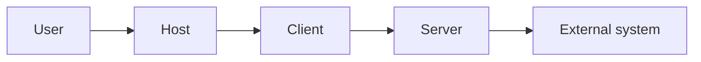
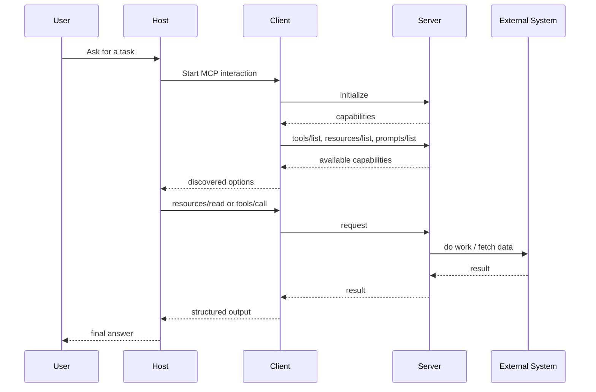
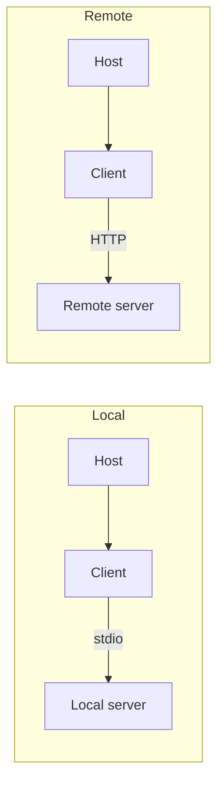

# MCP Primer

This document is a compact primer for understanding how the Model Context Protocol (MCP) works in practice.

It is intended as a companion to [README.md](../README.md), which acts as the main repository index.

## What MCP Solves

MCP gives AI hosts a standard way to connect to external capabilities.

Without MCP, every host or agent stack would need to invent its own contract for:

- discovering tools;
- reading external context;
- loading reusable prompts;
- handling authentication;
- supporting long-running actions;
- embedding richer interactive interfaces.

MCP standardizes these interactions so that one server can be reused across multiple hosts.

## The Main Participants

- `User`: the person asking for work to be done.
- `Host`: the AI application, such as Claude, ChatGPT, VS Code, or another MCP-capable product.
- `Client`: the MCP-speaking component inside the host.
- `Server`: the process or service exposing capabilities.
- `External system`: the real downstream target, such as a filesystem, database, SaaS API, browser, or internal platform.

## Core Primitives

MCP revolves around a small set of primitives.

### Tools

Tools are callable actions.

Examples:

- search a codebase;
- fetch a web page;
- open an issue;
- execute a deployment workflow.

### Resources

Resources are readable context exposed by a server.

Examples:

- a file;
- a generated report;
- a database record;
- a dashboard snapshot;
- a document template.

### Prompts

Prompts are reusable templates exposed by the server.

They help package workflows, defaults, and parameterized guidance.

## Basic Request Flow

## Local and Remote Modes

MCP supports both local and remote server models.

### Local

- typically launched as a local process;
- often uses `stdio`;
- common for filesystem, git, local tools, or secure workstation workflows.

### Remote

- runs as a network-accessible service;
- often uses Streamable HTTP;
- common for SaaS integrations, shared enterprise services, and cloud-hosted systems.

## Why Hosts and Clients Matter

Two hosts can connect to the same server and still behave differently.

That is because hosts differ in:

- extension support;
- auth UX;
- sandboxing model;
- app rendering support;
- tracing and debugging support;
- policy enforcement.

This is why the MCP ecosystem needs both:

- portable server contracts;
- clear client capability negotiation.

## Extensions

The base protocol stays relatively small. More advanced workflows are added through extensions.

### Tasks

Tasks provide durable handles for long-running work.

Use them when a tool call should not block until completion.

### Auth Extensions

Auth extensions cover patterns such as:

- OAuth client credentials;
- enterprise-managed authorization.

### MCP Apps

MCP Apps let a tool reference an interactive UI rendered inside the host.

This is useful for:

- dashboards;
- forms;
- previews;
- multi-step workflows.

## Security Model

MCP security is mainly about trust boundaries.

Questions that matter:

- Who owns the host?
- Who owns the server?
- What downstream systems are reachable?
- What scopes and credentials are in play?
- Can the server cause side effects?
- Can the app render untrusted UI?

Common risk themes:

- over-broad permissions;
- token passthrough;
- weak metadata validation;
- SSRF during remote metadata discovery;
- unsafe local execution.

## What Good MCP Projects Usually Have

A strong MCP project usually has:

- a clearly stated scope;
- explicit tool and resource schemas;
- documented auth and environment requirements;
- safe operational defaults;
- examples and debugging guidance;
- compatibility notes for major hosts;
- registry-ready metadata when distribution matters.

## Suggested Next Reading

- Main index: [README.md](../README.md)
- Chinese primer: [mcp-primer.zh-CN.md](mcp-primer.zh-CN.md)
- Curation policy: [../../docs/curation-policy.md](../../docs/curation-policy.md)
- Resource template: [../../docs/resource-template.md](../../docs/resource-template.md)
