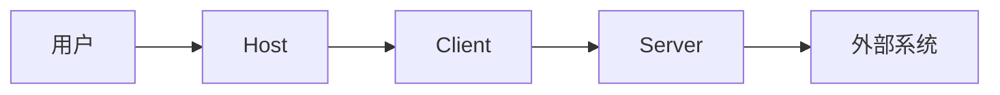
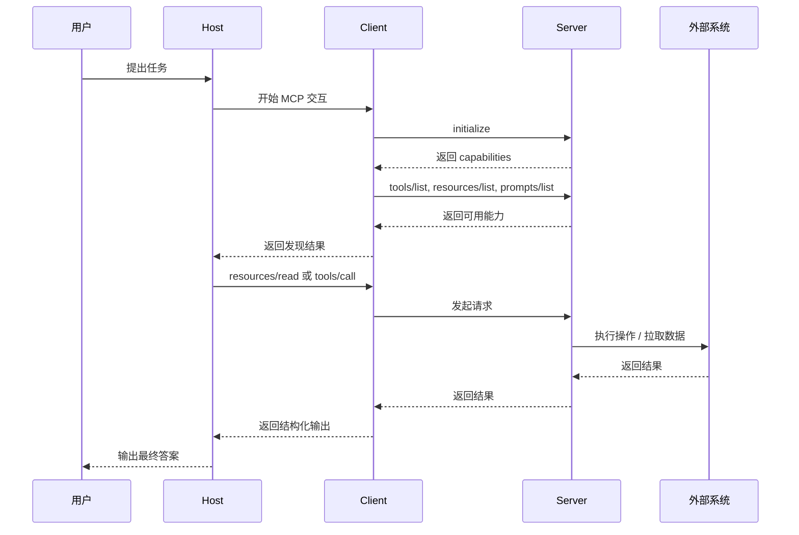
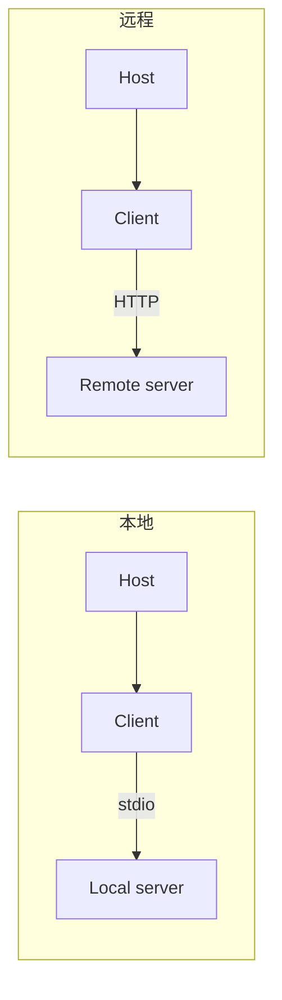

# MCP 入门说明

这是一份用来快速理解 Model Context Protocol（MCP）工作方式的入门文档。

它作为 [README.zh-CN.md](../README.zh-CN.md) 的补充存在，README 负责总入口，这里负责更系统地讲清原理。

## MCP 解决了什么问题

MCP 给 AI Host 提供了一种标准方式，用来连接外部能力。

如果没有 MCP，每个 Host 或 Agent 框架都需要自己重新发明一套约定，去解决这些问题：

- 如何发现工具；
- 如何读取外部上下文；
- 如何加载可复用提示模板；
- 如何处理认证；
- 如何支持长时间运行的操作；
- 如何嵌入更丰富的交互界面。

MCP 把这些交互标准化了，因此同一个 Server 可以被多个 Host 复用。

## 主要参与方

- `用户`：提出任务的人。
- `Host`：AI 应用，例如 Claude、ChatGPT、VS Code 或其他支持 MCP 的产品。
- `Client`：Host 内部真正负责“说 MCP”的协议组件。
- `Server`：对外暴露能力的进程或服务。
- `外部系统`：真正的下游目标，例如文件系统、数据库、SaaS API、浏览器或内部平台。

## 核心原语

MCP 的核心围绕少量原语展开。

### Tools

Tools 是可调用动作。

例如：

- 搜索代码库；
- 抓取网页；
- 创建 Issue；
- 触发部署流程。

### Resources

Resources 是 Server 暴露出来、可被读取的上下文。

例如：

- 文件；
- 生成的报告；
- 数据库记录；
- 仪表盘快照；
- 文档模板。

### Prompts

Prompts 是由 Server 暴露的可复用提示模板。

它们适合封装工作流、默认参数和带参数的引导式说明。

## 基础请求流程

## 本地与远程两种模式

MCP 同时支持本地 Server 和远程 Server。

### 本地模式

- 一般作为本机子进程启动；
- 常见传输方式是 `stdio`；
- 适合文件系统、git、本地工具或高安全工作站场景。

### 远程模式

- 作为网络服务运行；
- 常见传输方式是 Streamable HTTP；
- 适合 SaaS 集成、企业共享服务、云端系统。

## 为什么 Host 和 Client 也很重要

同一个 Server 接到两个不同 Host 上，实际体验可能完全不同。

原因通常在于 Host 的这些差异：

- 是否支持某些扩展；
- 认证交互体验如何；
- 沙箱模型如何；
- 是否支持渲染 Apps；
- 是否有 tracing / debugging 能力；
- 是否带有策略控制和权限边界。

所以 MCP 生态既需要：

- 可移植的 Server 契约；
- 也需要清晰的 Client 能力协商。

## 扩展能力

基础协议本身保持相对精简，更复杂的工作流通过扩展提供。

### Tasks

Tasks 为长时间运行的操作提供可持久化的句柄。

当工具调用不适合一直阻塞连接时，就应该考虑 Tasks。

### 认证扩展

认证扩展覆盖的典型模式包括：

- OAuth client credentials；
- enterprise-managed authorization。

### MCP Apps

MCP Apps 允许工具引用一个在 Host 内嵌渲染的交互式 UI。

适合：

- 仪表盘；
- 表单；
- 预览界面；
- 多步骤工作流。

## 安全模型

MCP 的安全核心主要是信任边界。

最关键的问题包括：

- 谁拥有 Host？
- 谁拥有 Server？
- Server 能访问哪些下游系统？
- 当前凭据和 scope 是什么？
- Server 是否能产生副作用？
- App 是否会渲染不受信任的 UI？

常见风险主题：

- 权限过宽；
- token passthrough；
- 元数据校验薄弱；
- 远程元数据发现过程中的 SSRF；
- 不安全的本地执行。

## 一个好的 MCP 项目通常具备什么

一个质量较高的 MCP 项目通常会具备：

- 清晰的范围定义；
- 明确的 tool / resource schema；
- 认证与环境要求说明；
- 安全的默认运行方式；
- 示例和调试说明；
- 对主流 Host 的兼容性说明；
- 如果需要分发，还会有适合 Registry 的元数据。

## 建议继续阅读

- 主入口：[README.zh-CN.md](../README.zh-CN.md)
- 英文 primer：[mcp-primer.md](mcp-primer.md)
- 收录规则：[../../docs/curation-policy.zh-CN.md](../../docs/curation-policy.zh-CN.md)
- 条目模板：[../../docs/resource-template.zh-CN.md](../../docs/resource-template.zh-CN.md)
