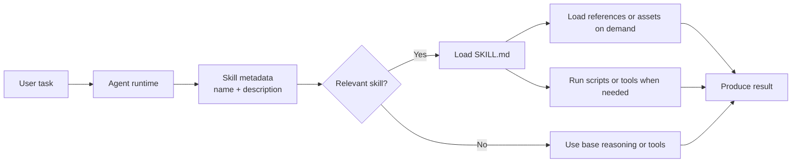
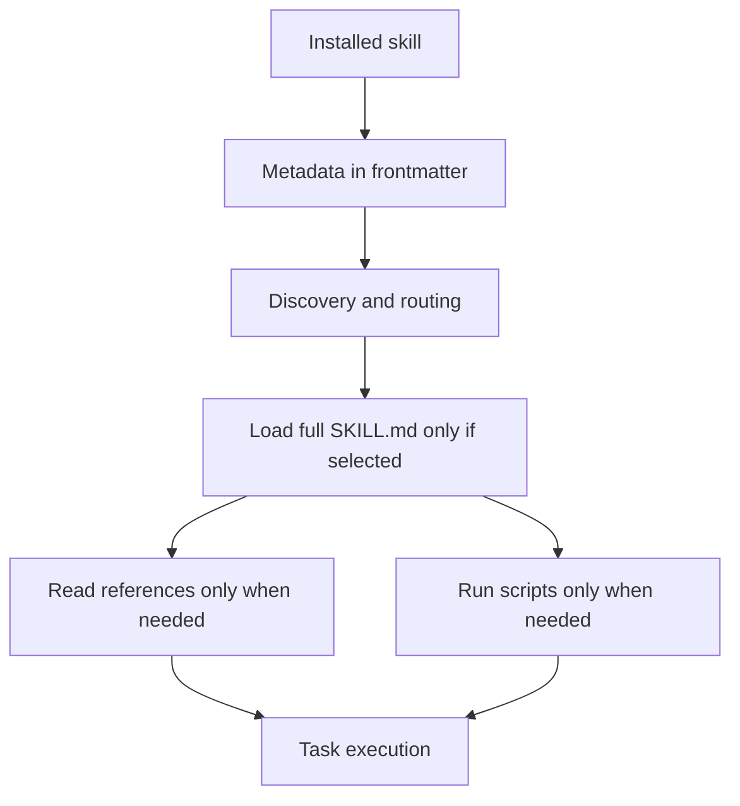
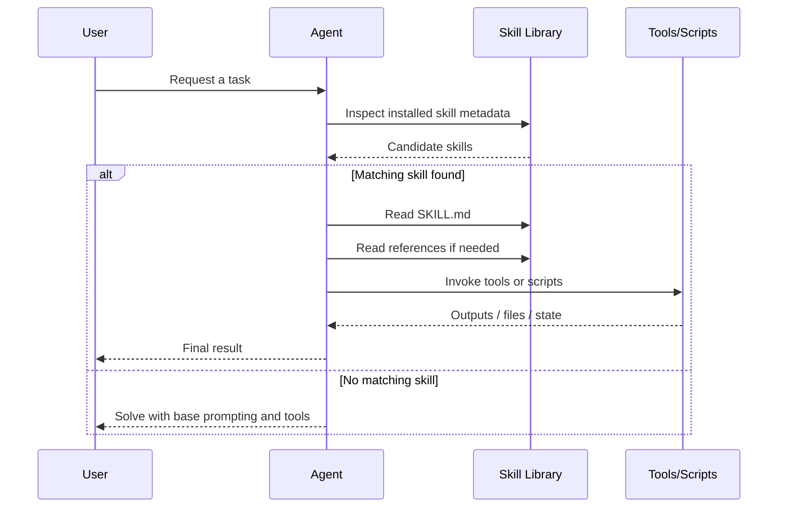
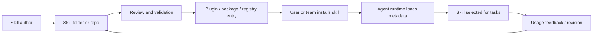

# Skills

A curated list of skills for LLMs and agents.

This repository focuses on reusable skill modules that help language models or agent systems perform specific tasks more reliably. A skill may be an instruction package, a tool-using workflow, a structured capability module, or a reusable domain-specific operation pattern.

## Project Status

- Scope: LLM and agent skills only
- Languages: English and Simplified Chinese
- Focus: official docs, real repositories, standards, evaluation, and security
- Excludes: generic prompt lists, broad AI tool directories, and weakly related agent resources

## Table of Contents

- [What Counts as a Skill](#what-counts-as-a-skill)
- [What This Repository Includes](#what-this-repository-includes)
- [What This Repository Does Not Include](#what-this-repository-does-not-include)
- [Categories](#categories)
- [How Skills Work](#how-skills-work)
- [Skills vs Other Abstractions](#skills-vs-other-abstractions)
- [Core Design Principles](#core-design-principles)
- [Starter List](#starter-list)
- [Curated Resources](#curated-resources)
- [Resource Map by Use Case](#resource-map-by-use-case)
- [Reading Paths](#reading-paths)
- [Suggested Entry Format](#suggested-entry-format)
- [Curation Principles](#curation-principles)
- [Planned Scope](#planned-scope)
- [Notes on Terminology](#notes-on-terminology)
- [Contributing](#contributing)

## What Counts as a Skill

In this repository, a skill usually has most of the following properties:

- a clear task boundary;
- reusable instructions, structure, or workflow;
- explicit target users such as an LLM, coding agent, research agent, or assistant runtime;
- practical execution value rather than only conceptual discussion;
- enough detail to be inspected, adapted, or implemented.

Typical examples include:

- coding skills for debugging, refactoring, testing, or repo exploration;
- research skills for literature review, evidence extraction, or synthesis;
- writing skills for editing, formatting, or bilingual documentation workflows;
- tool-using skills that define how an agent should call external tools safely;
- domain skills for legal, medical, finance, education, operations, or data work.

## What This Repository Includes

- official skill documentation or built-in skill collections;
- open-source skill repositories;
- skill templates and scaffolds;
- guides for building, packaging, testing, or maintaining skills;
- marketplaces, indexes, or registries centered on skills;
- representative examples showing how skills are organized in practice.

## What This Repository Does Not Include

- generic prompt lists without clear skill structure;
- broad AI tool directories unrelated to reusable skills;
- agent frameworks that do not expose a skill concept in practice;
- promotional pages with little technical detail;
- copied protected content or unverified mirrors.

## Categories

### Official and Platform Skills

Resources published by platforms, runtimes, or model providers that define a native skill mechanism.

### Open-Source Skill Repositories

Projects collecting reusable skills for coding agents, research agents, assistants, or workflow systems.

### Skill Templates and Scaffolds

Starter structures, manifests, conventions, and packaging patterns for creating new skills.

### Skill Authoring Guides

Documentation explaining how to define scope, tool use, instructions, evaluation, and maintenance for skills.

### Skill Discovery and Registries

Indexes, catalogs, or marketplaces that help users find reusable skills.

### Representative Skill Examples

Concrete, well-structured skills that show strong design patterns or practical workflows.

## How Skills Work

Skills sit between raw tools and one-off prompts. They package reusable operational knowledge so an agent can discover, load, and execute a workflow only when needed.

### Conceptual model



### Progressive disclosure



### Runtime sequence



### Distribution and governance



## Skills vs Other Abstractions

| Abstraction | Main purpose | Typical contents | Best use |
| --- | --- | --- | --- |
| Prompt | One-shot instruction | Plain text guidance | Ad hoc task framing |
| Tool | Atomic capability | API, CLI, function, browser action | Single operation |
| Skill | Reusable workflow layer | `SKILL.md`, references, scripts, assets | Repeatable multi-step task execution |
| Plugin / package | Distribution unit | One or more skills, apps, metadata | Installation and sharing |

## Core Design Principles

- Narrow task boundaries beat broad “do anything” skills.
- Metadata quality matters because routing starts from `name` and `description`.
- Progressive disclosure keeps startup context small and loads detail only when needed.
- Skills work best when they encode stable workflows, not temporary chat preferences.
- Distribution and trust matter: installability, provenance, review, and revision are part of the skill lifecycle.

## Starter List

If you only want a compact first pass, start with these:

- [OpenAI Codex: Agent Skills](https://developers.openai.com/codex/skills) - Official guide to repo-scoped skills, lifecycle, and the skill-versus-plugin model in Codex.
- [OpenAI: Using skills to accelerate OSS maintenance](https://developers.openai.com/blog/skills-agents-sdk) - Practical case study of skills used in real repository maintenance workflows.
- [Anthropic: Introducing Agent Skills](https://claude.com/blog/skills) - Product-level overview of what agent skills are and why they matter.
- [Claude Code Docs: Extend Claude with skills](https://code.claude.com/docs/en/skills) - Implementation reference for `SKILL.md`, frontmatter, supporting files, and invocation behavior.
- [Agent Skills Standard](https://agentskills.io/home) - Open interoperability-oriented reference for portable skill packaging.
- [anthropics/skills](https://github.com/anthropics/skills) - Public repository for studying how real skills are organized and shared.
- [openai/openai-agents-python/.agents/skills](https://github.com/openai/openai-agents-python/tree/main/.agents/skills) - Repo-local examples for coding and maintenance workflows.
- [OpenSkillEval](https://arxiv.org/abs/2605.23657) - Evaluation framework for skill-augmented agents and their skills.
- [Under the Hood of SKILL.md](https://arxiv.org/abs/2605.11418) - Security-focused study of registry and discovery-layer risks.

## Curated Resources

### Official and Platform Skills

- [OpenAI Codex: Agent Skills](https://developers.openai.com/codex/skills) - Official Codex documentation for authoring, discovering, storing, and distributing skills across multiple scopes.
- [OpenAI: Using skills to accelerate OSS maintenance](https://developers.openai.com/blog/skills-agents-sdk) - Detailed case study of repo-local `.agents/skills` folders in maintenance workflows.
- [Anthropic: Introducing Agent Skills](https://claude.com/blog/skills) - Official introduction to skills as folders of instructions, scripts, and resources across Claude surfaces.
- [Anthropic Engineering: Equipping agents for the real world with Agent Skills](https://www.anthropic.com/engineering/equipping-agents-for-the-real-world-with-agent-skills) - Architecture-focused explanation of skill design, progressive disclosure, and bundled context.
- [Claude Code Docs: Extend Claude with skills](https://code.claude.com/docs/en/skills) - Official documentation for local installation, authoring, and runtime behavior in Claude Code.
- [Claude Platform Docs: Using Agent Skills with the API](https://platform.claude.com/docs/en/build-with-claude/skills-guide) - Platform guide for using Anthropic-managed and custom skills through the API.
- [Claude Help Center: Use skills in Claude](https://support.claude.com/en/articles/12512180-use-skills-in-claude) - End-user guide for enabling, uploading, and managing skills in Claude apps.

### Open Standards and Interoperability

- [Agent Skills Standard](https://agentskills.io/home) - Open specification for portable, cross-platform skill packaging and lifecycle concepts.

### Platform Comparison

| Platform | Skill entrypoint | Main locations | Distribution model | Notable traits |
| --- | --- | --- | --- | --- |
| OpenAI Codex | `SKILL.md` plus optional references, scripts, and assets | Repo, user, admin, and system scopes | Local skill folders for authoring; plugins for installation and sharing | Strong repo-local workflow pattern and clear skill-vs-plugin separation |
| Claude / Claude Code | `SKILL.md` with YAML frontmatter | Enterprise, personal, project, and plugin scopes | Direct folders, uploaded ZIP skills, or plugin-packaged skills | Command-style invocation, auto-loading, frontmatter controls, nested discovery |
| Agent Skills Standard | Standardized skill package model | Depends on implementation | Portable spec for registries and runtimes | Focus on interoperability and governance |
| OpenClaw | `SKILL.md`-based workspace skill directories | Workspace and registry-connected ecosystems | Registry and marketplace-oriented distribution | Open marketplace and public ecosystem experimentation |

### Open-Source Skill Repositories and Ecosystems

- [anthropics/skills](https://github.com/anthropics/skills) - Anthropic’s public repository of Agent Skills, including example skills and marketplace-oriented distribution guidance.
- [openai/openai-agents-python/.agents/skills](https://github.com/openai/openai-agents-python/tree/main/.agents/skills) - Real repository-scoped skills used in the OpenAI Agents Python SDK.
- [openai/openai-agents-js/.agents/skills](https://github.com/openai/openai-agents-js/tree/main/.agents/skills) - Real repository-scoped skills used in the OpenAI Agents JS SDK.
- [openclaw/openclaw](https://github.com/openclaw/openclaw) - Open-source agent runtime with workspace skills stored as directories containing `SKILL.md`.
- [ClawHub](https://clawhub.ai/) - Public registry and marketplace for OpenClaw skills and plugins.
- [JayLZhou/Awesome-Agent-Skills](https://github.com/JayLZhou/Awesome-Agent-Skills) - Research-oriented collection covering the broader agent-skills ecosystem.
- [scienceaix/agentskills](https://github.com/scienceaix/agentskills) - Another active collection of papers, projects, and resources focused on agent skills.
- [Huangdingcheng/SkillWiki](https://github.com/Huangdingcheng/SkillWiki) - Open implementation of a “living knowledge infrastructure” for agent skills.

### Skill Authoring, Templates, and Practice

- [OpenAI repo-local skill pattern](https://developers.openai.com/blog/skills-agents-sdk) - Practical guidance for keeping workflow knowledge close to code in `.agents/skills`.
- [Anthropic skill creation flow](https://support.claude.com/en/articles/12512180-use-skills-in-claude) - Operational guidance for packaging a skill folder and uploading it as a ZIP in Claude apps.
- [Codex skill distribution model](https://developers.openai.com/codex/skills) - Explains when to keep skills as local folders versus packaging them as plugins.

## Resource Map by Use Case

Use the main sections above as the primary source list. This map is only for fast routing:

- Coding: start with [Starter List](#starter-list), then read [Open-Source Skill Repositories and Ecosystems](#open-source-skill-repositories-and-ecosystems).
- Research: use [Research, Evaluation, and Surveys](#research-evaluation-and-surveys), then [Landscape](docs/landscape.md).
- Browser and Web: use [Open-Source Skill Repositories and Ecosystems](#open-source-skill-repositories-and-ecosystems) plus [Landscape](docs/landscape.md).
- Writing and Documentation: start with [Skill Authoring, Templates, and Practice](#skill-authoring-templates-and-practice).
- Operations and Release Work: start with [Official and Platform Skills](#official-and-platform-skills) and [Starter List](#starter-list).
- Data, Evaluation, and Governance: use [Research, Evaluation, and Surveys](#research-evaluation-and-surveys), [Security and Governance](#security-and-governance), and [Landscape](docs/landscape.md).

### Research, Evaluation, and Surveys

- [A Comprehensive Survey on Agent Skills: Taxonomy, Techniques, and Applications](https://arxiv.org/abs/2605.07358) - Broad survey covering representation, acquisition, retrieval, selection, evolution, and applications.
- [Agent Skills for Large Language Models: Architecture, Acquisition, Security, and the Path Forward](https://arxiv.org/abs/2602.12430) - Survey focused on architecture, interoperability, lifecycle, and safety.
- [OpenSkillEval](https://arxiv.org/abs/2605.23657) - Evaluation framework for testing skill-augmented agents and the skills themselves on realistic tasks.
- [SkillRevise](https://arxiv.org/abs/2606.01139) - Framework for iteratively improving LLM-authored skills using execution traces.
- [SkillWiki paper](https://arxiv.org/abs/2606.16523) - Research companion to the SkillWiki project for large-scale skill knowledge infrastructure.

### Security and Governance

- [Under the Hood of SKILL.md](https://arxiv.org/abs/2605.11418) - Study of semantic supply-chain attacks against skill discovery, selection, and governance.
- [Malicious Or Not](https://arxiv.org/abs/2603.16572) - Security analysis of large-scale skill ecosystems with repository-aware classification.
- [OpenSkillEval paper](https://arxiv.org/abs/2605.23657) - Useful not only for evaluation, but also for understanding practical quality variance across public skills.

## Reading Paths

### If you want to understand the concept first

1. Start with [Starter List](#starter-list).
2. Then read [Official and Platform Skills](#official-and-platform-skills).
3. Use [Landscape](docs/landscape.md) for the deeper model.

### If you want to study real skill layouts

1. Read [Open-Source Skill Repositories and Ecosystems](#open-source-skill-repositories-and-ecosystems).
2. Compare the platform behaviors in [Platform Comparison](#platform-comparison).
3. Use [Landscape](docs/landscape.md) for lifecycle and governance context.

### If you want to research quality, security, and ecosystem design

1. Start with [Research, Evaluation, and Surveys](#research-evaluation-and-surveys).
2. Then read [Security and Governance](#security-and-governance).
3. Use [Landscape](docs/landscape.md) for the ecosystem model.

## Suggested Entry Format

Repository or documentation entry:

```md
- [Resource Name](link) - Short objective description of the skill system, repository scope, or authoring value.
```

Skill example entry:

```md
- [Skill Name](link) - Reusable skill for a specific task, including its target runtime, workflow boundary, and main use case.
```

## Curation Principles

- Prefer original sources.
- Keep descriptions factual and concise.
- Include only resources directly relevant to LLM or agent skills.
- Avoid vague entries that do not show a reusable capability structure.
- Keep English and Chinese content aligned when the main list changes.

Detailed policies:

- [Curation Policy](../docs/curation-policy.md)
- [Link Check](../docs/link-check.md)
- [Resource Template](../docs/resource-template.md)
- [Landscape](docs/landscape.md)
- [Contributing Guide](../CONTRIBUTING.md)

## Planned Scope

This repository is intended for skills used by:

- LLM-based assistants;
- coding agents;
- browser or workflow agents;
- research and analysis agents;
- domain-specific agent systems.

It is not intended to become a general list of prompts, AI tools, or unrelated agent papers.

## Notes on Terminology

- “Skill” in this repository means a reusable capability package for an LLM or agent, not a human learning skill.
- The exact packaging differs by platform, but common patterns include `SKILL.md`, metadata frontmatter, optional references, optional scripts, and optional assets.
- In many ecosystems, the skill is the workflow definition, while a plugin or marketplace package is the distribution unit.
- Many useful skills are not “tools” themselves. They often encode when to use tools, in what order, with what constraints, and how to validate results.
- The most durable skills usually sit at the workflow layer: code review, docs sync, release review, browser task execution, research synthesis, or domain-specific operating procedures.

## Contributing

Contributions are welcome if the resource clearly belongs to the scope above and can be verified from an official or stable source.

See [CONTRIBUTING.md](../CONTRIBUTING.md) for details.

## License

[MIT](../LICENSE)
