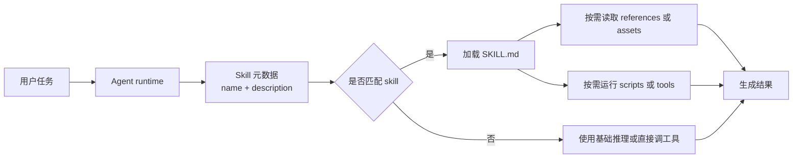
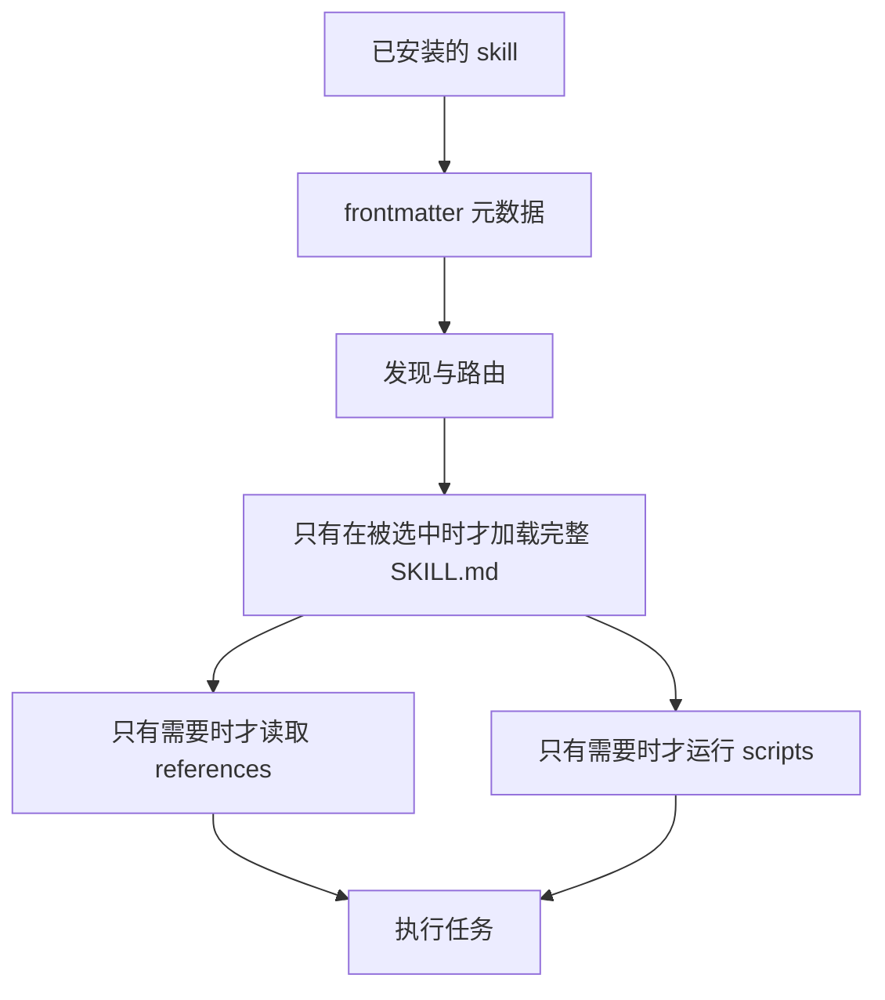
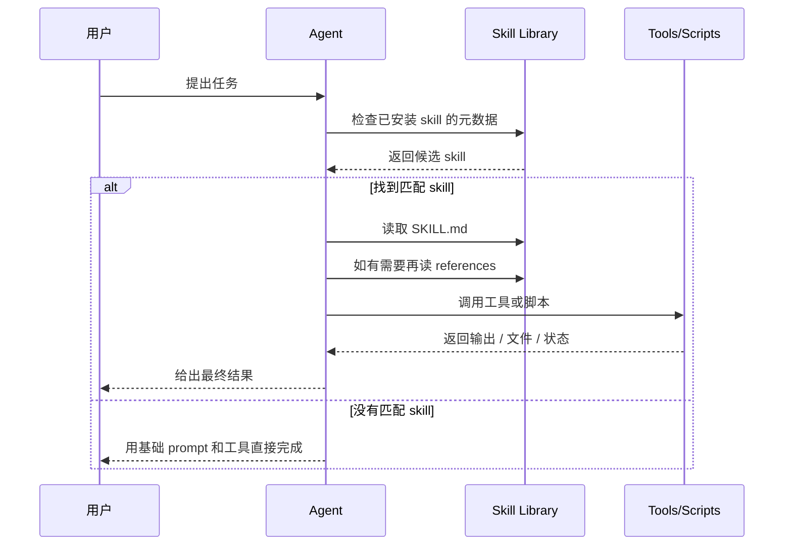

# Skills

一个面向 LLM 与 Agent skill 的精选资源列表。

本仓库聚焦可复用的 skill 模块，用于帮助语言模型或 agent 系统更稳定地完成特定任务。这里的 skill 可以是指令包、带工具调用约束的工作流、结构化能力模块，或可重复使用的领域操作模式。

## 项目状态

- 范围：只关注 LLM / agent skills
- 语言：英文与简体中文双语
- 重点：官方文档、真实仓库、开放标准、评测与安全
- 不收录：通用 prompt 列表、泛 AI 工具目录、弱相关 agent 资源

## 目录

- [什么算 Skill](#什么算-skill)
- [本仓库收录什么](#本仓库收录什么)
- [本仓库不收录什么](#本仓库不收录什么)
- [分类](#分类)
- [Skills 如何工作](#skills-如何工作)
- [Skills 与其他抽象的区别](#skills-与其他抽象的区别)
- [核心设计原则](#核心设计原则)
- [起步清单](#起步清单)
- [精选资源](#精选资源)
- [按用途导航](#按用途导航)
- [推荐阅读路径](#推荐阅读路径)
- [建议条目格式](#建议条目格式)
- [收录原则](#收录原则)
- [计划覆盖范围](#计划覆盖范围)
- [术语说明](#术语说明)
- [贡献](#贡献)

## 什么算 Skill

在本仓库中，一个资源通常满足以下大部分特征时，才算 skill：

- 任务边界清晰；
- 具备可复用的指令、结构或工作流；
- 面向明确对象，例如 LLM、编码 agent、研究 agent 或 assistant runtime；
- 强调实际执行价值，而不只是概念讨论；
- 提供足够细节，便于理解、改造或实现。

常见示例包括：

- 用于调试、重构、测试、仓库探索的编码 skill；
- 用于文献综述、证据提取、信息综合的研究 skill；
- 用于编辑、格式化、双语文档协同的写作 skill；
- 定义 agent 如何安全调用外部工具的 tool-using skill；
- 面向法律、医疗、金融、教育、运营、数据分析等领域的 domain skill。

## 本仓库收录什么

- 官方 skill 文档或平台内置 skill 集合；
- 开源 skill 仓库；
- skill 模板与脚手架；
- 关于 skill 构建、打包、测试、维护的指南；
- 以 skill 为核心的 marketplace、index 或 registry；
- 能展示 skill 实际组织方式的代表性案例。

## 本仓库不收录什么

- 没有明确 skill 结构的通用 prompt 列表；
- 与可复用 skill 无直接关系的泛 AI 工具目录；
- 实际上没有 skill 概念落地的 agent framework；
- 技术细节很少的宣传页面；
- 复制的受保护内容或无法核验的镜像资源。

## 分类

### 官方与平台技能体系

由平台、runtime 或模型提供方发布，原生支持 skill 机制的资源。

### 开源 Skill 仓库

收录面向编码 agent、研究 agent、assistant 或 workflow 系统的可复用 skill 项目。

### Skill 模板与脚手架

用于新建 skill 的起步结构、manifest、约定和打包模式。

### Skill 编写指南

讲解如何定义 skill 的边界、工具使用方式、指令结构、评估方式和维护方法的文档。

### Skill 发现与注册目录

帮助用户查找可复用 skill 的索引、目录或 marketplace。

### 代表性 Skill 示例

结构清晰、设计扎实、工作流实用的具体 skill 示例。

## Skills 如何工作

skill 位于原始 tool 和一次性 prompt 之间。它把可复用的操作知识打包起来，让 agent 只在需要时发现、加载并执行某个工作流。

### 概念模型



### 渐进式披露



### 运行时顺序



### 分发与治理


## Skills 与其他抽象的区别

| 抽象 | 主要作用 | 常见内容 | 最适合什么 |
| --- | --- | --- | --- |
| Prompt | 一次性指令 | 普通文本指令 | 临时任务描述 |
| Tool | 原子能力 | API、CLI、函数、浏览器动作 | 单步操作 |
| Skill | 可复用工作流层 | `SKILL.md`、references、scripts、assets | 可重复的多步任务执行 |
| Plugin / 包 | 分发单元 | 一个或多个 skill、app、元数据 | 安装、共享、复用 |

## 核心设计原则

- skill 的任务边界越窄，通常越稳定。
- 元数据质量很关键，因为路由从 `name` 和 `description` 开始。
- 渐进式披露能控制启动时上下文体积，细节只在需要时加载。
- skill 更适合编码稳定工作流，而不是临时聊天偏好。
- 分发与信任也是 skill 生命周期的一部分，包括安装、来源、审查和修订。

## 起步清单

如果你只想先看最值得读的一批资源，可以从这里开始：

- [OpenAI Codex: Agent Skills](https://developers.openai.com/codex/skills) - OpenAI 官方指南，适合理解 repo-scoped skills、生命周期和 skill / plugin 模型。
- [OpenAI: Using skills to accelerate OSS maintenance](https://developers.openai.com/blog/skills-agents-sdk) - 展示 skill 在真实仓库维护工作流中的实践方式。
- [Anthropic: Introducing Agent Skills](https://claude.com/blog/skills) - 从产品层说明 agent skills 是什么、为什么重要。
- [Claude Code Docs: Extend Claude with skills](https://code.claude.com/docs/en/skills) - 关于 `SKILL.md`、frontmatter、supporting files 和调用行为的实现参考。
- [Agent Skills Standard](https://agentskills.io/home) - 面向可移植 skill 打包的开放互操作参考。
- [anthropics/skills](https://github.com/anthropics/skills) - 适合观察真实 skill 如何组织与共享的公开仓库。
- [openai/openai-agents-python/.agents/skills](https://github.com/openai/openai-agents-python/tree/main/.agents/skills) - coding 和 maintenance 类 repo-local skill 的真实示例。
- [OpenSkillEval](https://arxiv.org/abs/2605.23657) - 面向 skill-augmented agents 的评测框架。
- [Under the Hood of SKILL.md](https://arxiv.org/abs/2605.11418) - 聚焦 registry 与 discovery 层风险的安全研究。

## 精选资源

### 官方与平台技能体系

- [OpenAI Codex: Agent Skills](https://developers.openai.com/codex/skills) - OpenAI 官方 Codex 文档，覆盖 skill 的编写、发现、存放位置和分发方式。
- [OpenAI: Using skills to accelerate OSS maintenance](https://developers.openai.com/blog/skills-agents-sdk) - 详细展示 `.agents/skills` 在仓库维护工作流中的使用方式。
- [Anthropic: Introducing Agent Skills](https://claude.com/blog/skills) - Anthropic 官方介绍，把 skill 定义为由 instructions、scripts、resources 组成的目录。
- [Anthropic Engineering: Equipping agents for the real world with Agent Skills](https://www.anthropic.com/engineering/equipping-agents-for-the-real-world-with-agent-skills) - 从架构视角解释 skill 设计、progressive disclosure 和上下文打包。
- [Claude Code Docs: Extend Claude with skills](https://code.claude.com/docs/en/skills) - Claude Code 官方文档，覆盖本地安装、编写和运行时行为。
- [Claude Platform Docs: Using Agent Skills with the API](https://platform.claude.com/docs/en/build-with-claude/skills-guide) - Anthropic 平台文档，说明如何通过 API 使用官方与自定义 skills。
- [Claude Help Center: Use skills in Claude](https://support.claude.com/en/articles/12512180-use-skills-in-claude) - 面向终端用户的技能启用、上传和管理说明。

### 开放标准与可移植性

- [Agent Skills Standard](https://agentskills.io/home) - 面向跨平台可移植 skill 的开放标准与生命周期约定。

### 平台对照

| 平台 | Skill 入口 | 主要位置 | 分发方式 | 典型特点 |
| --- | --- | --- | --- | --- |
| OpenAI Codex | `SKILL.md` 加可选 references、scripts、assets | repo、user、admin、system 范围 | 本地 skill 目录用于编写；plugin 用于安装与共享 | 强调 repo-local workflow，并清晰区分 skill 与 plugin |
| Claude / Claude Code | 带 YAML frontmatter 的 `SKILL.md` | enterprise、personal、project、plugin 范围 | 直接目录、上传 ZIP skill、或打包成 plugin | 支持命令式调用、自动加载、frontmatter 控制、嵌套发现 |
| Agent Skills Standard | 标准化 skill 包模型 | 取决于具体实现 | 面向 registry 和 runtime 的可移植规范 | 更强调互操作与治理 |
| OpenClaw | 基于 `SKILL.md` 的 workspace skill 目录 | workspace 及 registry 生态 | 偏 registry / marketplace 的分发模型 | 公开 marketplace 和生态实验性更强 |

### 开源 Skill 仓库与生态

- [anthropics/skills](https://github.com/anthropics/skills) - Anthropic 官方公开 skill 仓库，包含示例 skill 与 marketplace 分发方式。
- [openai/openai-agents-python/.agents/skills](https://github.com/openai/openai-agents-python/tree/main/.agents/skills) - OpenAI Agents Python SDK 仓库中的真实 repo-scoped skills。
- [openai/openai-agents-js/.agents/skills](https://github.com/openai/openai-agents-js/tree/main/.agents/skills) - OpenAI Agents JS SDK 仓库中的真实 repo-scoped skills。
- [openclaw/openclaw](https://github.com/openclaw/openclaw) - 使用 `SKILL.md` 目录式 skill 的开源 agent runtime。
- [ClawHub](https://clawhub.ai/) - OpenClaw 生态中的公开 skill / plugin 注册目录与 marketplace。
- [JayLZhou/Awesome-Agent-Skills](https://github.com/JayLZhou/Awesome-Agent-Skills) - 偏研究视角的 agent skills 资源总表。
- [scienceaix/agentskills](https://github.com/scienceaix/agentskills) - 另一个持续维护的 agent skills 论文、项目与资源集合。
- [Huangdingcheng/SkillWiki](https://github.com/Huangdingcheng/SkillWiki) - 以“技能知识基础设施”为目标的开源实现。

### Skill 编写、模板与实践

- [OpenAI repo-local skill pattern](https://developers.openai.com/blog/skills-agents-sdk) - 说明为什么把 workflow 知识直接放在 `.agents/skills` 里是个好模式。
- [Anthropic skill creation flow](https://support.claude.com/en/articles/12512180-use-skills-in-claude) - 展示如何把 skill 文件夹打成 ZIP 并上传到 Claude apps。
- [Codex skill distribution model](https://developers.openai.com/codex/skills) - 解释什么情况下应该保留为本地 skill 文件夹，什么情况下应打包成 plugin。

## 按用途导航

把上面的主资源区当作主要列表，这里只做快速导航：

- Coding：先看 [起步清单](#起步清单)，再看 [开源 Skill 仓库与生态](#开源-skill-仓库与生态)。
- Research：看 [研究、评估与综述](#研究评估与综述)，再结合 [生态地图](docs/landscape.zh-CN.md)。
- Browser and Web：看 [开源 Skill 仓库与生态](#开源-skill-仓库与生态) 和 [生态地图](docs/landscape.zh-CN.md)。
- Writing and Documentation：先看 [Skill 编写、模板与实践](#skill-编写模板与实践)。
- Operations and Release Work：先看 [官方与平台技能体系](#官方与平台技能体系) 和 [起步清单](#起步清单)。
- Data, Evaluation, and Governance：看 [研究、评估与综述](#研究评估与综述)、[安全与治理](#安全与治理) 和 [生态地图](docs/landscape.zh-CN.md)。

### 研究、评估与综述

- [A Comprehensive Survey on Agent Skills: Taxonomy, Techniques, and Applications](https://arxiv.org/abs/2605.07358) - 覆盖表示、获取、检索、选择、演化与应用的综合综述。
- [Agent Skills for Large Language Models: Architecture, Acquisition, Security, and the Path Forward](https://arxiv.org/abs/2602.12430) - 更强调架构、互操作、生命周期和安全的综述。
- [OpenSkillEval](https://arxiv.org/abs/2605.23657) - 用于评估 skill-augmented agent 与具体 skill 质量的框架。
- [SkillRevise](https://arxiv.org/abs/2606.01139) - 基于执行轨迹迭代修订 LLM 编写 skill 的方法。
- [SkillWiki paper](https://arxiv.org/abs/2606.16523) - 与 SkillWiki 项目对应的研究论文。

### 安全与治理

- [Under the Hood of SKILL.md](https://arxiv.org/abs/2605.11418) - 分析针对 skill 发现、选择和治理的语义供应链攻击。
- [Malicious Or Not](https://arxiv.org/abs/2603.16572) - 面向大规模 skill 生态的安全分析与仓库上下文校验方法。
- [OpenSkillEval paper](https://arxiv.org/abs/2605.23657) - 除了评估，也有助于理解公开 skill 在实际任务中的质量波动。

## 推荐阅读路径

### 如果你想先搞清楚概念

1. 先看 [起步清单](#起步清单)。
2. 再看 [官方与平台技能体系](#官方与平台技能体系)。
3. 最后配合 [生态地图](docs/landscape.zh-CN.md) 建立完整模型。

### 如果你想看真实 skill 目录长什么样

1. 读 [开源 Skill 仓库与生态](#开源-skill-仓库与生态)。
2. 对照 [平台对照](#平台对照) 看不同实现方式。
3. 再用 [生态地图](docs/landscape.zh-CN.md) 补生命周期和治理语境。

### 如果你更关心质量、安全和生态设计

1. 先读 [研究、评估与综述](#研究评估与综述)。
2. 再读 [安全与治理](#安全与治理)。
3. 最后结合 [生态地图](docs/landscape.zh-CN.md) 理解整个生态结构。

## 建议条目格式

仓库或文档条目：

```md
- [资源名称](link) - 用一句客观描述说明 skill 系统、仓库范围或其编写参考价值。
```

具体 skill 示例条目：

```md
- [Skill 名称](link) - 面向特定任务的可复用 skill，说明目标 runtime、工作流边界和主要用途。
```

## 收录原则

- 优先使用原始来源。
- 描述保持客观、简洁。
- 只收录与 LLM / Agent skill 直接相关的资源。
- 不收录看不出“可复用能力结构”的模糊条目。
- 主列表变更时保持中英文内容同步。

详细规则见：

- [收录规则](../docs/curation-policy.zh-CN.md)
- [链接检查](../docs/link-check.zh-CN.md)
- [资源模板](../docs/resource-template.zh-CN.md)
- [生态地图](docs/landscape.zh-CN.md)
- [贡献指南](../CONTRIBUTING.zh-CN.md)

## 计划覆盖范围

本仓库面向以下系统中的 skill：

- 基于 LLM 的 assistant；
- 编码 agent；
- 浏览器或 workflow agent；
- 研究与分析 agent；
- 领域专用 agent 系统。

本仓库不打算扩展成通用 prompt 列表、泛 AI 工具目录或无关的 agent 论文合集。

## 术语说明

- 本仓库里的 “skill” 指 LLM / agent 的可复用能力包，不是泛指人的技能。
- 不同平台的打包形式略有差异，但常见结构通常包括 `SKILL.md`、frontmatter 元数据、可选 references、可选 scripts 和可选 assets。
- 在很多生态里，skill 是工作流定义本身，而 plugin 或 marketplace package 是分发单元。
- 很多有价值的 skill 本身并不是 tool，而是规定“什么时候调什么 tool、按什么顺序调、带什么约束、如何校验结果”的工作流层。
- 最耐用的 skill 通常位于 workflow 层，例如 code review、docs sync、release review、browser task execution、research synthesis 或领域操作规程。

## 贡献

如果某个资源能被稳定核验，并且明确属于上述范围，欢迎提交补充。

详见 [CONTRIBUTING.zh-CN.md](../CONTRIBUTING.zh-CN.md)。

## 许可证

[MIT](../LICENSE)
