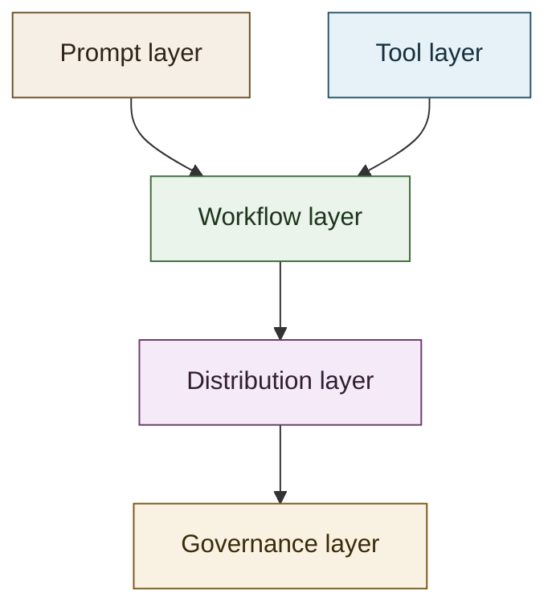
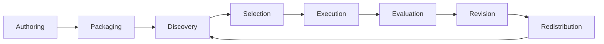
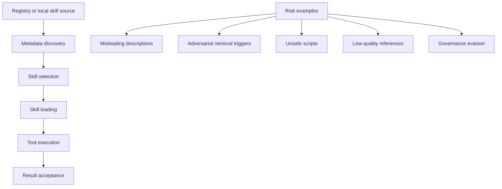

# Skill Landscape

This document expands the main README with a deeper map of the LLM and agent skill ecosystem.

## Why Skills Matter

Skills exist because base prompting and raw tool access are not enough for repeatable work. A reusable skill gives an agent:

- a stable task boundary;
- procedural knowledge that can be loaded on demand;
- optional scripts, references, and assets;
- a unit that can be reviewed, revised, installed, and shared.

In practice, skills are the workflow layer between prompts and tools.

## Core Layers

### Prompt layer

The base instruction surface. Good for one-off tasks, weak for durable, repeatable operations.

### Tool layer

Atomic capabilities such as shell, browser, APIs, file search, or code execution.

### Workflow layer

The main role of skills. A skill encodes how to combine tools and reasoning for a narrow recurring task.

### Distribution layer

Folders, plugins, registries, marketplaces, or ZIP packages that make skills installable.

### Governance layer

Review, provenance, trust, policy, risk detection, versioning, and ecosystem controls.

## Skill Lifecycle

### 1. Authoring

The author defines a narrow task, writes instructions, chooses allowed tools, and adds references or scripts only when they improve reuse.

### 2. Packaging

The skill becomes a directory, plugin, ZIP, or registry entry with enough metadata for discovery.

### 3. Discovery

The runtime or registry decides which skills are candidates based on metadata such as `name`, `description`, path, context, or registry search.

### 4. Selection

An agent or human chooses whether to load the skill. This stage is sensitive because misleading metadata can bias selection.

### 5. Execution

The runtime loads the instruction body, then reads references or runs scripts only when needed.

### 6. Evaluation

The output and trace are checked for correctness, completeness, cost, latency, policy compliance, and task success.

### 7. Revision

The skill is refined based on failures, drift, new constraints, or better task decomposition.

### 8. Redistribution

Updated skills are reinstalled locally, republished through a plugin, or updated in a registry.

## Platform Patterns

### OpenAI Codex

- Uses skills as the authoring format for reusable workflows.
- Supports repo, user, admin, and system scopes.
- Separates skill authoring from plugin distribution.
- Strong fit for repo-local operational knowledge.

### Claude / Claude Code

- Uses `SKILL.md` with YAML frontmatter and optional supporting files.
- Supports enterprise, personal, project, and plugin locations.
- Treats skills as both directly invokable commands and auto-loadable contextual modules.
- Offers strong frontmatter controls such as invocation restrictions and allowed tools.

### Agent Skills Standard

- Focuses on portability and common packaging semantics.
- Useful as a conceptual anchor for multi-platform ecosystems.

### OpenClaw and ClawHub

- Useful for studying marketplace and registry dynamics in a more open ecosystem.
- Highlights how skills move from local workflow artifacts to public installable capabilities.

## Design Heuristics

### Keep scope narrow

A good skill should solve one recurring class of task. Over-broad skills become vague and unreliable.

### Optimize metadata

Discovery often begins from a short description. Weak metadata makes good skills invisible; manipulative metadata creates trust problems.

### Separate overview from detail

Keep `SKILL.md` concise. Put examples, API details, checklists, or long references in supporting files.

### Encode decisions, not just reminders

The highest-value skills capture operational choices:

- which tool to use;
- when to stop;
- what to verify;
- how to recover from common failure modes.

### Prefer stable workflows

Skills work best for durable patterns such as code review, release checks, browser task execution, docs synchronization, or domain operating procedures.

## Quality Dimensions

Use these dimensions to judge whether a skill belongs in this repository.

| Dimension | What to look for |
| --- | --- |
| Relevance | Direct connection to LLM or agent skills |
| Reusability | Clear workflow that can be applied again |
| Structure | Explicit instructions, metadata, or packaging |
| Verifiability | Official or stable source |
| Operational value | Helps agents complete real tasks |
| Safety | No obvious policy, provenance, or supply-chain red flags |
| Maintainability | Evidence of upkeep, documentation, or evolution |

## Risk Surface

Main risk categories:

- semantic retrieval manipulation;
- misleading descriptions that bias agent choice;
- unsafe or opaque scripts;
- hidden side effects in operational workflows;
- poor provenance in public marketplaces;
- stale guidance that no longer matches the environment.

## Evaluation Questions

When reviewing a skill, ask:

1. Is the task boundary clear?
2. Does the metadata make the right skill discoverable?
3. Does the body contain reusable workflow knowledge instead of chat fluff?
4. Are supporting files justified and referenced clearly?
5. Are side effects explicit?
6. Is there an obvious way to verify success or failure?
7. Is the source trustworthy?
8. Would this still be useful after the current conversation ends?

## Related Reading

- [OpenAI Codex: Agent Skills](https://developers.openai.com/codex/skills)
- [Using skills to accelerate OSS maintenance](https://developers.openai.com/blog/skills-agents-sdk)
- [Anthropic: Introducing Agent Skills](https://claude.com/blog/skills)
- [Claude Code Docs: Extend Claude with skills](https://code.claude.com/docs/en/skills)
- [Agent Skills Standard](https://agentskills.io/home)
- [OpenSkillEval](https://arxiv.org/abs/2605.23657)
- [Under the Hood of SKILL.md](https://arxiv.org/abs/2605.11418)
