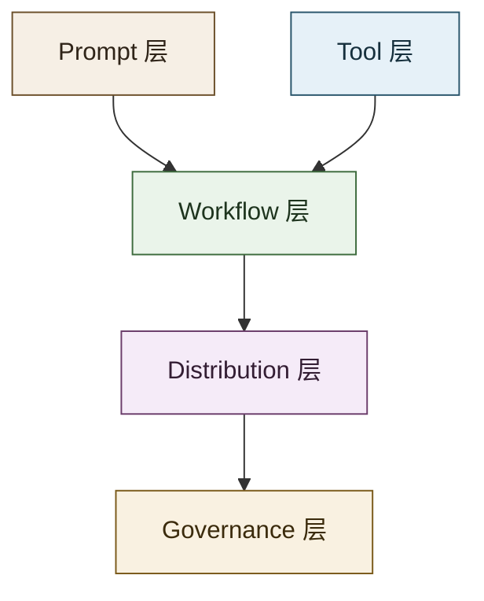
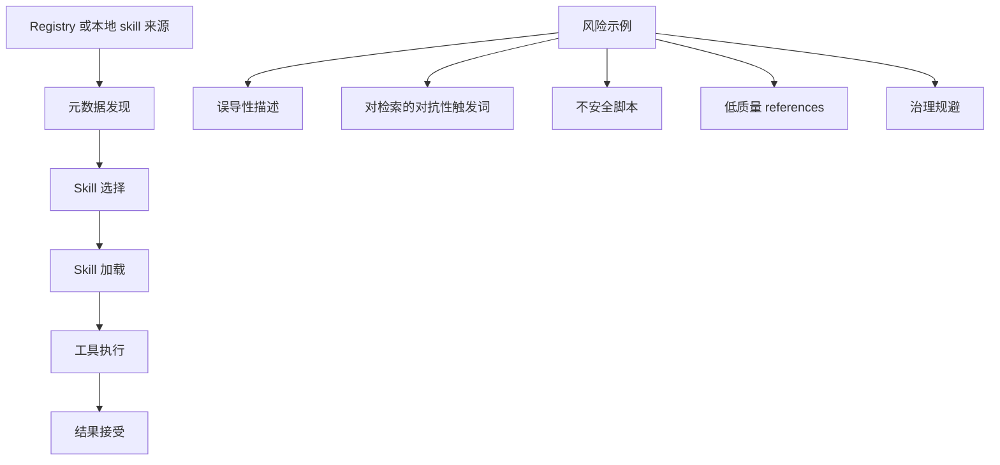

# Skill 生态地图

本文档是主 README 的深入展开，用来更系统地梳理 LLM / agent skill 生态。

## 为什么需要 Skills

仅靠基础 prompt 和原始 tool，往往不足以支撑可重复、可治理的复杂工作。可复用 skill 的价值在于，它为 agent 提供了：

- 稳定的任务边界；
- 按需加载的过程知识；
- 可选的 scripts、references 和 assets；
- 可审查、可修订、可安装、可共享的能力单元。

实践里，skill 本质上是 prompt 和 tool 之间的工作流层。

## 核心分层

### Prompt 层

基础指令表面。适合一次性任务，不适合长期复用的稳定操作。

### Tool 层

原子能力，例如 shell、browser、API、file search、code execution。

### Workflow 层

这是 skill 的核心位置。skill 编码的是：如何把工具和推理组合成一个狭义、可复用的任务流程。

### Distribution 层

目录、plugin、registry、marketplace、ZIP 包等，使 skill 可以被安装、共享、发现。

### Governance 层

审查、来源、信任、策略、风险检测、版本演化和生态控制。

## Skill 生命周期

### 1. 编写

作者定义狭义任务，写 instructions，选择允许的 tools，并在确有必要时加入 references 或 scripts。

### 2. 打包

skill 变成一个目录、plugin、ZIP 包或 registry 条目，并带有足够的元数据用于发现。

### 3. 发现

runtime 或 registry 根据 `name`、`description`、路径、上下文或搜索机制决定候选 skill。

### 4. 选择

由 agent 或人决定是否加载该 skill。这个阶段很敏感，因为误导性元数据会直接影响选择结果。

### 5. 执行

runtime 先加载 instruction 主体，再在必要时读取 references 或执行 scripts。

### 6. 评估

检查输出与轨迹的正确性、完整性、成本、延迟、策略合规性和任务成功率。

### 7. 修订

根据失败、漂移、新约束或更好的任务拆分来改进 skill。

### 8. 再次分发

更新后的 skill 被重新安装、本地替换、打包进 plugin，或重新发布到 registry。

## 平台模式

### OpenAI Codex

- 把 skill 作为可复用 workflow 的编写格式；
- 支持 repo、user、admin、system 多层作用域；
- 把 skill 编写和 plugin 分发明确区分开；
- 特别适合 repo-local operational knowledge。

### Claude / Claude Code

- 使用带 YAML frontmatter 的 `SKILL.md` 以及可选 supporting files；
- 支持 enterprise、personal、project、plugin 多位置加载；
- skill 既可以当命令调用，也可以在上下文中自动加载；
- frontmatter 控制能力比较强，例如 invocation restriction 和 allowed tools。

### Agent Skills Standard

- 强调跨平台可移植性和公共打包语义；
- 很适合作为多平台生态的概念锚点。

### OpenClaw 与 ClawHub

- 适合观察更开放的 registry / marketplace 型 skill 生态；
- 能帮助理解 skill 如何从本地工作流资产演变成公开可安装能力。

## 设计启发

### 边界要窄

好的 skill 应该解决一类反复出现的任务。边界太宽，skill 就会变得模糊且不稳定。

### 元数据要好

发现往往从简短描述开始。元数据差，好的 skill 也找不到；元数据带欺骗性，就会形成信任问题。

### 总览与细节分离

让 `SKILL.md` 保持精炼，把例子、API 细节、长清单和深文档放到 supporting files。

### 编码的是决策，不只是提醒

高价值 skill 捕捉的是操作决策：

- 该用哪个 tool；
- 何时停止；
- 该验证什么；
- 常见失败如何恢复。

### 优先稳定工作流

skill 最适合承载稳定模式，例如 code review、release checks、browser task execution、docs synchronization 或领域操作规程。

## 质量维度

判断一个 skill 是否值得收录，可以看这些维度：

| 维度 | 关注点 |
| --- | --- |
| 相关性 | 是否直接属于 LLM / agent skill 主题 |
| 可复用性 | 是否存在可再次应用的明确工作流 |
| 结构化程度 | 是否有清晰 instructions、metadata 或打包形态 |
| 可核验性 | 是否来自官方或稳定来源 |
| 操作价值 | 是否真的帮助 agent 完成任务 |
| 安全性 | 是否存在明显的策略、来源或供应链风险 |
| 可维护性 | 是否看得到维护、文档或演化痕迹 |

## 风险面

主要风险类别包括：

- 语义检索操纵；
- 通过描述偏置 agent 的选择；
- 不安全或不透明的脚本；
- 隐蔽副作用的 operational workflows；
- 公开 marketplace 中薄弱的来源控制；
- 已经过时但仍被继续加载的旧指导。

## 评审问题

检查一个 skill 时，可以问：

1. 任务边界是否清楚？
2. 元数据能否让正确的 skill 被发现？
3. 主体内容是不是可复用工作流，而不是聊天废话？
4. supporting files 是否有必要、引用是否清楚？
5. 副作用是否明确？
6. 是否容易验证成功或失败？
7. 来源是否可信？
8. 这项能力在当前对话结束后是否仍然有价值？

## 延伸阅读

- [OpenAI Codex: Agent Skills](https://developers.openai.com/codex/skills)
- [Using skills to accelerate OSS maintenance](https://developers.openai.com/blog/skills-agents-sdk)
- [Anthropic: Introducing Agent Skills](https://claude.com/blog/skills)
- [Claude Code Docs: Extend Claude with skills](https://code.claude.com/docs/en/skills)
- [Agent Skills Standard](https://agentskills.io/home)
- [OpenSkillEval](https://arxiv.org/abs/2605.23657)
- [Under the Hood of SKILL.md](https://arxiv.org/abs/2605.11418)
